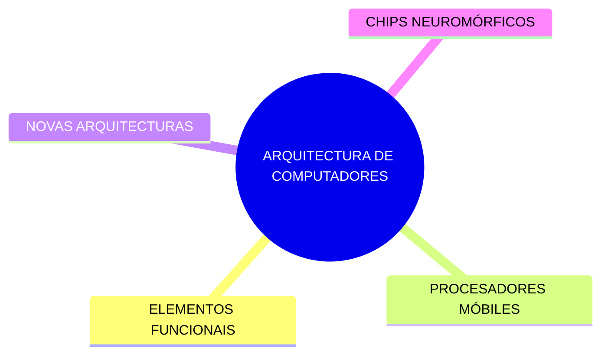

Usage
Create diagrams in markdown using mermaid fenced code blocks:

```mermaid
graph TD;
    A-->B;
    A-->C;
    B-->D;
    C-->D;
```

aaa

```mermaid
mindmap
  root((ARQUITECTURA DE COMPUTADORES))
    ELEMENTOS FUNCIONAIS
       
    PROCESADORES MÓBILES
      
    NOVAS ARQUITECTURAS

    CHIPS NEUROMÓRFICOS
```
