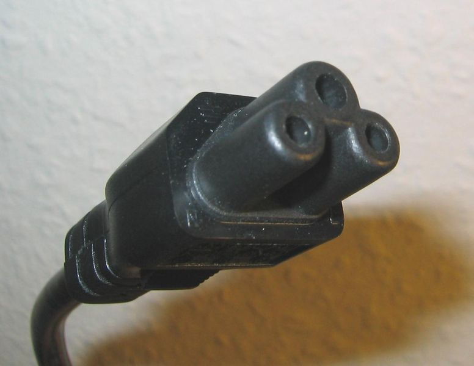
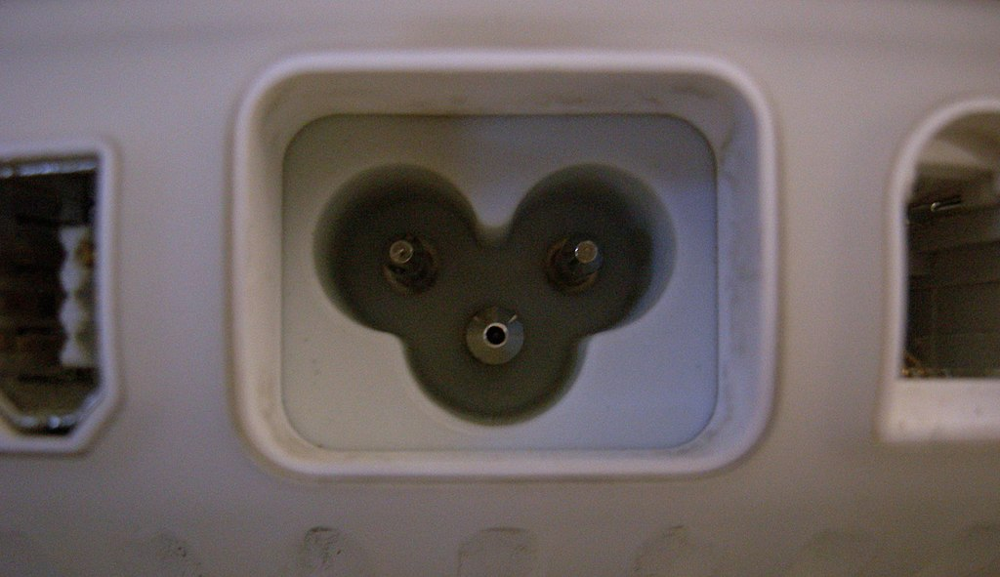

# Conectores externos de alimentación

---
# Conectores externos de alimentación
- C5 (Trebol) |  C6 
- C9 |  C10
- C15 | C16
- C7 | C8
- C13 | C14
- C15 
- C17 | C18 
- C19 | C20
---
# Conectores externos de alimentación
## C5 (Trebol)  
-  El conector C5 de 3 clavijas y 2,5A. Coloquialmente se les llama:  "Mickey Mouse” o Clover Leaf (hoja de trébol).

---
# Conectores externos de alimentación
## C6   
 

---
# Conectores externos de alimentación
## C7  
 
 

---
# Conectores  internos de alimentación
---
# Conectores  internos de alimentación
## Molex

---
# Conectores  internos de alimentación
## Molex

---
# Conectores  internos de alimentación
## Molex

---
