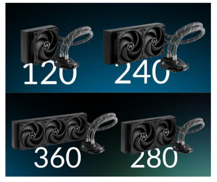

<!--
Notas para a presentación
-->
# Sistemas de refrigeración líquida, All-In-One.

  

<!-- _colorPreset: dark -->

---
# Fundamentos de los sistemas de refrigeración líquid All-In-One.

Un sistema de refrigeración líquida AIO (All-In-One) es un circuito cerrado herméticamente compuesto por:
* **un bloque de agua**, colocado sobre el procesador;
* una **bomba**, que impulsa el fluido refrigerante;
* y un **radiador**, que enfría el fluido transfiriendo energía al medio, generalmente de forma activa con la ayuda de ventiladores. 

Para conectar los distintos elementos se emplean tubos flexibles y racores. 

---
# Esquema básico de AIO

  

En la actualidad, la mayoría de sistemas AIO del mercado incorporan la bomba dentro del bloque de agua.

---
# Funcionamento

  

---

#  Modelos
##  Asetek 545LC

  

Ano de desenvolvemento 2010

---  

# Modelos
##  Corsair iCUE H100i Elite 

  

Ano de desenvolvemento 2022

---  
# Radiadores.
* Los radiadores son los encargados de transferir el calor del fluido refrigerante al medio. 
* El fluido circula por el interior del radiador a través de una serie de tubos o canales. 

  

---  
## Radiadores.
* Los radiadores emplean una configuración de doble pasada, por lo que la entrada y salida de los tubos se encuentra en el mismo lateral. 

  

---
## Materiales dos radiadores.
* El cobre y el aluminio por su alta relación entre conductividad térmica y coste.
* La carcasa pueden verse otros materiales, como latón o plástico, estos no afectan al rendimiento
* En términos de rendimiento, el cobre es mejor conductor de calor que el aluminio
* Los radiadores de aluminio ofrecen un menor peso y costes.

---  
## Tamaño de los radiadores.

* Un radiador con un ventilador de 120 mm y apartir de la unidad se generan los restantes tamaños como múltiplos. 

  

---  
## FPI (Fins Per Inch)
* Densidad de aletas mide la cantidad de aletas en una determinada superficie.

  

---  
# Ventiladores.
* En la actualidad, los ventiladores emplean conectores de 3 o 4 pines.
* Los de 4 pines están  preparados para funcionar en modo PWM (Pulse Width Modulation)

  

---  
## Ventiladores: Parámetros
* **Velocidad máxima de giro**: medida en rpm o revoluciones por minuto. Es directamente  proporcional al resto de parámetros.
* **Flujo de aire máximo**: en CFM (Cubic Feet per Minute). Indica el caudal de aire que el ventilador es capaz de trasegar.
* **Presión estática**: en mmH2O. Indica la presión que puede darle al aire que trasiega.   
   * Es inversamente proporcional al flujo de aire, es decir, a mayor presión deba entregarse menor caudal suministrará y viceversa. 
   * Es por ello que para aplicaciones en radiadores de refrigeración líquida de elevado espesor y densidad de aletas deberán emplearse ventiladores capaces de suministrar suficiente presión como para que exista un adecuado caudal de aire.
* **Sonoridad máxima**: en dB. Depende principalmente de la velocidad de giro del ventilador y el tipo de rodamientos que equipe.

---  
# Bombas.
* Las bombas empleadas en sistemas de refrigeración líquida AIO estas bombas suelen ir integradas en el bloque de CPU
* Están limitadas al uso de 12V
* Ofrecen potencias en el rango de los 2 a 5 W.

---  
# Ubicación de la bomba
* La bomba  se integra dentro del bloque de CPU debido a que, montando el radiador en la parte superior del sistema, es la posición más
baja del circuito. 
* Esto evita posibles problemas de cebado de la bomba en caso de pérdida paulatina de fluido, así como también reduce ruidos por acumulación de burbujas en los puntos
más elevados del circuito.
* Esta situación  alarga el tiempo de vida de la bomba 

---  
# Bloque
* El bloque de CPU o bloque de agua, del término en inglés waterblock.
* Encargado de sustraer el calor del procesador. 
* Generalmente de cobre para maximizar su rendimiento, aunque también se puede encontrar en aluminio. 

--- 
# Líquido refrigerante.

* Habitualmente está baseado en  una solución de agua destilada, por su alta capacidad de transferencia de calor
unido a su baja conductividad eléctrica y ausencia de microorganismos. 
* Al agua destilada se le añade una serie de aditivos para mejorar sus características, como anticongelantes y
biocidas
* También es habitual emplear tintes para colorear el agua en los circuitos de refrigeración líquida con tubos transparentes 

---
## Refrigerante: Cuando cambiarlo?

[¿Cómo saber cuándo hay que cambiar de refrigeración líquida AIO?](https://hardzone.es/tutoriales/componentes/cuando-cambiar-renovar-refrigeracion-liquida-aio/)