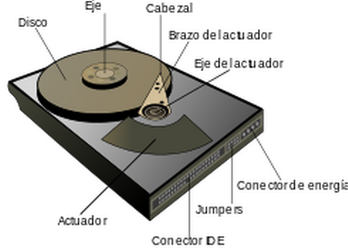
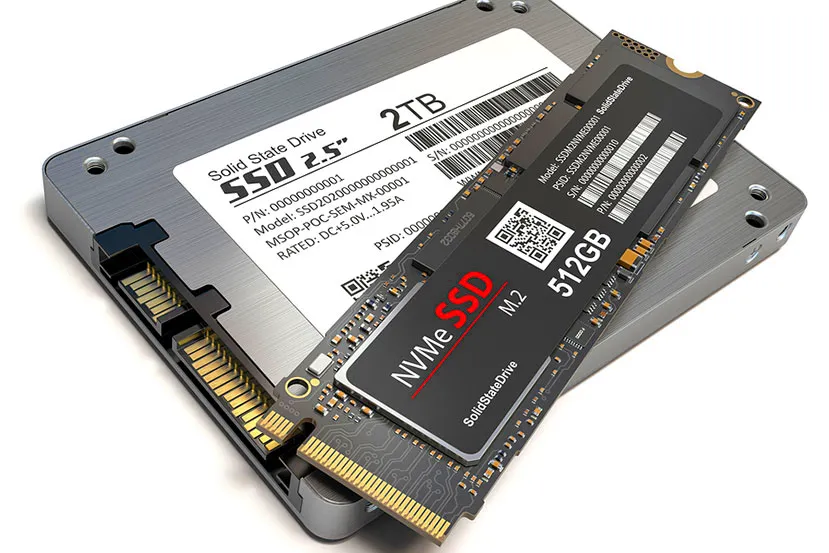

<!--
Notas para a presentación
-->
#  Almacenamento
  

<!-- _colorPreset: dark -->
---
- índice

---
# Que é un disco duro?
- Un disco duro é un dispositivo utilizado polo computador para almacenar datos durante un tempo longo. Os discos duros pertencen á chamada memoria secundaria. 
- Os discos duros están compostos por unha estrutura física e lóxica, respecto a a estrutura física refírese a como esta composto interiormente un disco duro, é dicir, as pezas ou compoñentes que a conforman como os pratos, as cabezas de lectura/escritura, o impulsor de  cabezal, as pistas, os sectores, etc.
- Con respecto á estrutura lóxica esta formada polo sector de arranque, a  FAT (Táboa de asignación de ficheiros), o directorio raíz e a zona de datos para arquivos e  subdirectorios
---
# Tipos de discos.
- HDD
- SDD
- SSHD
 
 ---

# HDD

* Son os discos máis populares tamén chamados discos mecánicos ou  HDD ( Hard  Disk  Drives) 
* Estes discos están conformados  por unha serie de discos que xiran a gran velocidade sobre un eixo, mentres un  cabezal magnético cambia de posición para escribir ou ler os datos da superficie dos discos.
---
# SSD

* As unidades de estado sólido ou  SSD ( Solid  State  Drive) que utilizan chips de memoria non volátil para almacenar os datos.
* O proceso de lectura e escritura realízase mediante impulsos eléctricos, os discos  SSD non contan con pezas móbiles no seu interior.
---
# SSHD
* As unidades híbridas de estado sólido ou  SSHD ( Solid- State  Hybrid  Drive). Este tipo de almacenamento é un híbrido que utiliza as tecnoloxías de  SSD e  HDD para facelas traballar xuntas nun só dispositivo.
* Consiste nun sistema de discos mecánicos exactamente igual ao que podes atopar en calquera  HDD, e unha parte na que se integran varios chips de memoria como os utilizados no almacenamento  SSD.
* O conxunto complétase cunha controladora que xestiona e decide que os datos aos que accedes máis habitualmente gárdense na parte  SSD, mentres que os arquivos que usas de forma esporádica, pasan ao sistema  HDD.
