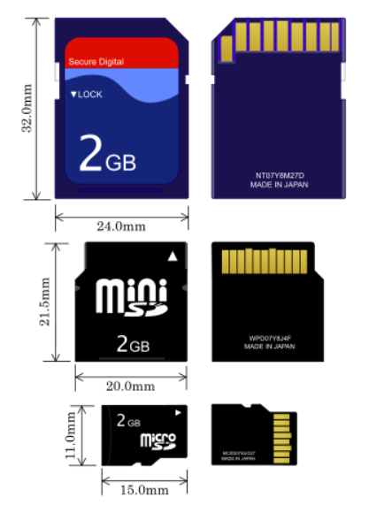

<!--
Notas para a presentación
-->
# Tarxetas SD  
   

<!-- _colorPreset: dark -->
---
- [Tarxetas SD](#tarxetas-sd)
- [Que é?](#que-é)
- [Tamaños](#tamaños)
- [Clases](#clases)
- [Clases](#clases-1)
- [Clases](#clases-2)
- [Clases : Aplicación](#clases--aplicación)
- [Clases](#clases-3)
- [Capacidades](#capacidades)
 

---
# Que é? 
- Unha tarxeta SD (Secure Dixital) é unha tarxeta de memoria para almacenar contidos en dispositivos portátiles
- Hai 3 cousas que debes ter en conta para comprar unha tarxeta SD: o seu **tamaño**, a súa **capacidade** de almacenaxe e a **velocidade** á que pode copiar e transmitir os datos.
  

---
# Tamaños

---
# Clases

---
# Clases
* Coa chegada de SDHC e SDXC a asociación SD inclúe un novo bus chamado **UHS Speed Class**.
  * UHS-I Clase 1 (U1) a 10 MB/s
  * UHS-I Clase 3 (U3) a 30 MB/s

---
# Clases

---
# Clases : Aplicación

---
# Clases
As tarxetas tamén poden diferenciarse pola súa clase de velocidade de vídeo, que é unha clase a parte que é moi importante ter tamén en conta á hora de comprar tarxetas para facer vídeos, xa que inflúen na cantidade máxima de fotogramas por segundo aos que se pode gravar.
* **Clase V6**: Está nas tarxetas de Clase 6, para a gravación de vídeo HD a 72p.
* **Clase V10**: Está nas tarxetas de Clase 10 e UHS1, para sacar fotos de alta definición consecutivas e gravar vídeos en FullHD de 1080p  ou resolucións inferiores
* **Clase V30**: Nas tarxetas de Clase Ou3, para vídeos 4K a 24/30 fps
* **Clase V60**: Nas tarxetas de Clase Ou3, para vídeos 4K a 60/120 fps
* **Clase V90**: Nas tarxetas de Clase Ou3, para vídeos 4K a 60/120 fps ou 8K

---
# Capacidades
As tarxetas clasifícanse tamén en 3 tipos que atoparás especificados na propia tarxeta:

* **SD SC** (Standard Capacity) ou simplemente SD: con capacidade para almacenar ata 2GB de datos.
* **SD HC** (High Capacity): permiten gardar ata 32GB.
* **SD XC** (eXtended Capacity): poden almacenar ata 2TB (2.000GB)

