<!--
Notas para a presentación
-->
# Instalación OpenMediaVault 
 
  
<style>
  :root{
     --color-background: #101010;
     --color-foreground: #fff;
  }
  h1{
    color:#73a832;
  }

  h2{
    color:#32a883;
  }

  .anotacion {
  font-size: 10px;
}

  footer{
    float: right;
  }
</style>

<!-- _colorPreset: dark -->
---
# 01
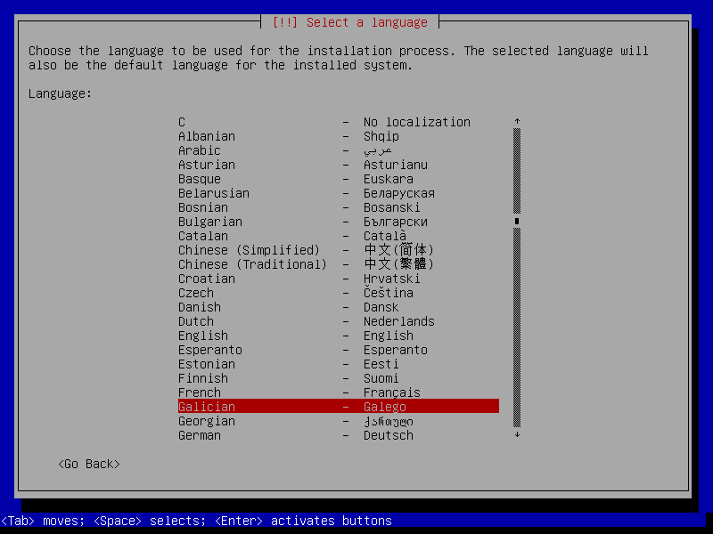

---
# 02
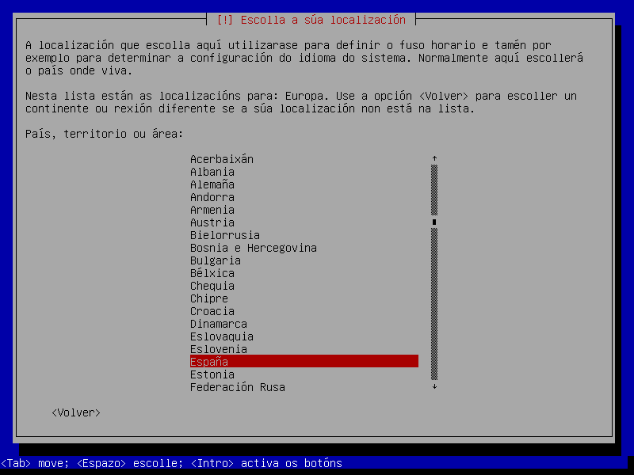

---
# 03
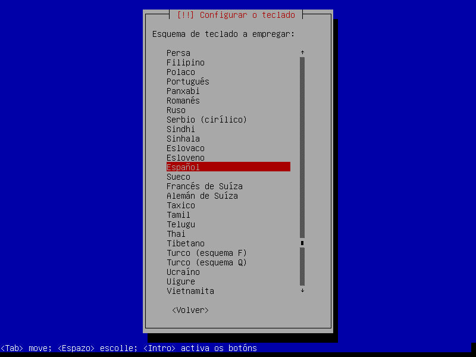

---
# 04
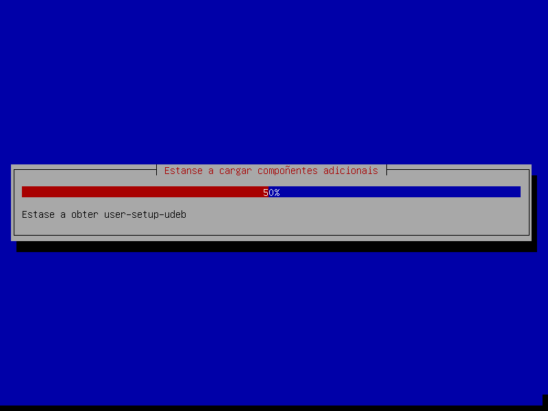

---
# 05


---
# 06
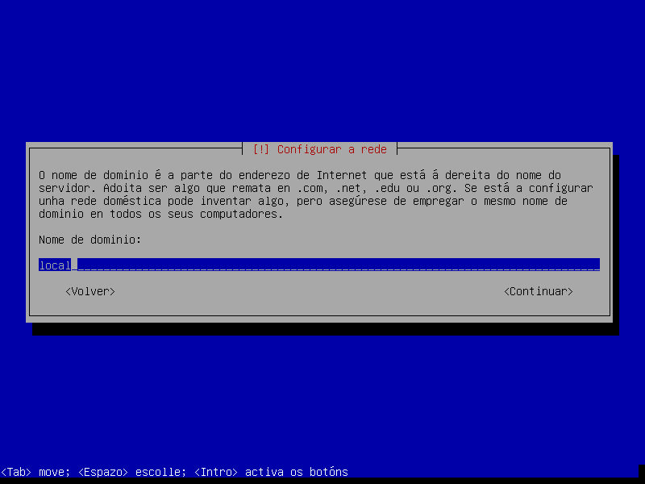

---
# 07
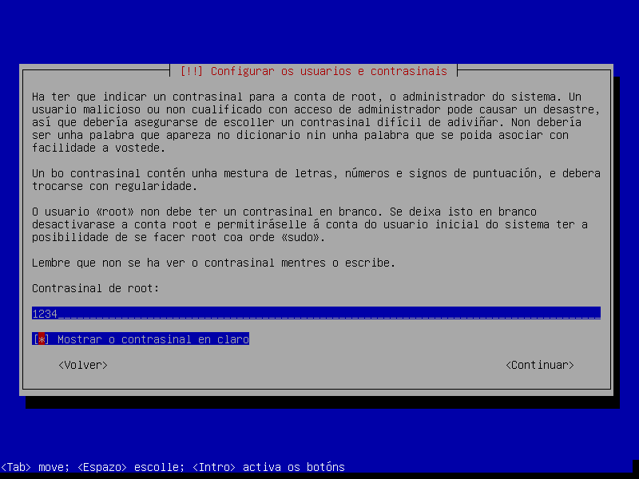

---
# 08
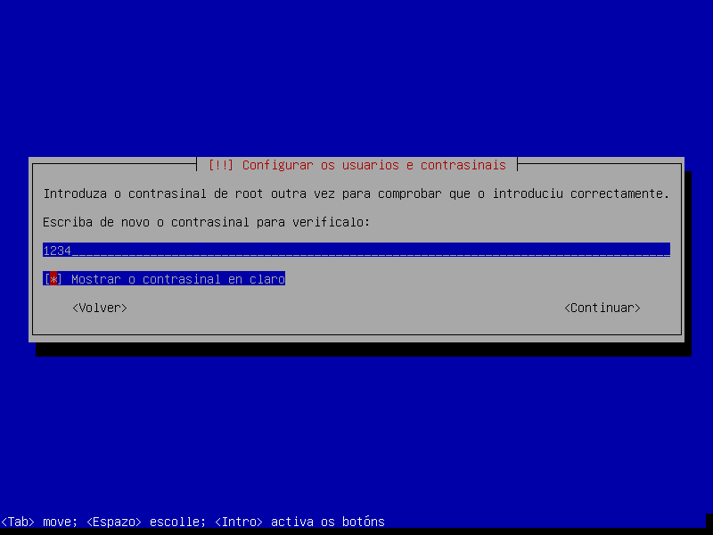

---
# 09
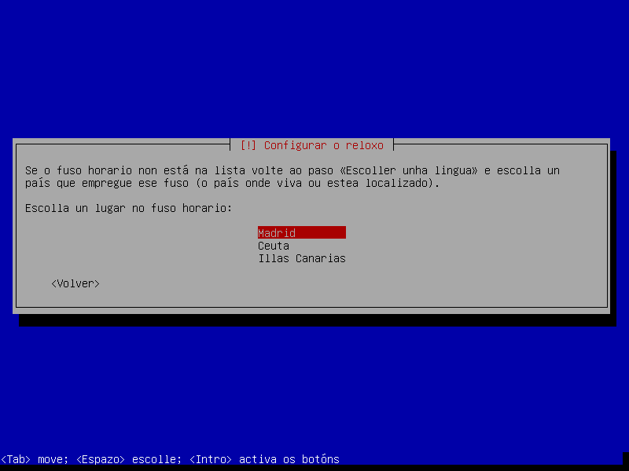

---
# 10
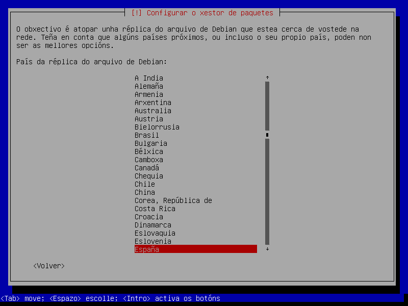

---
# 11
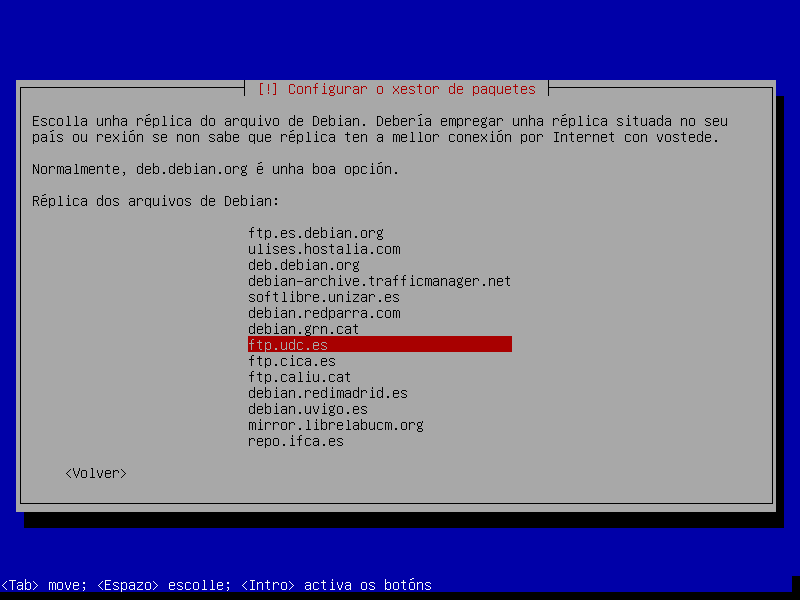

---
# 12
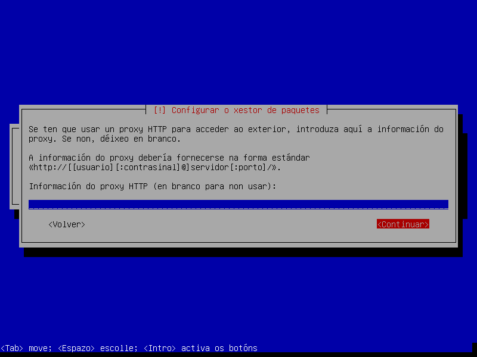

---
# 13
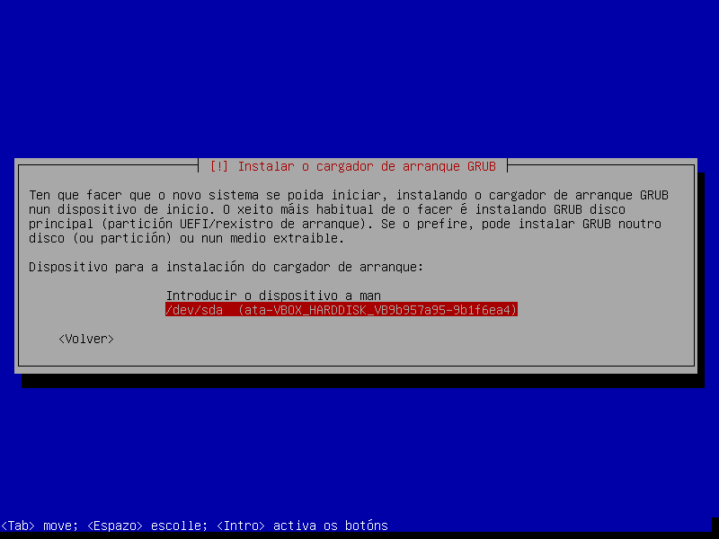

---
# 14
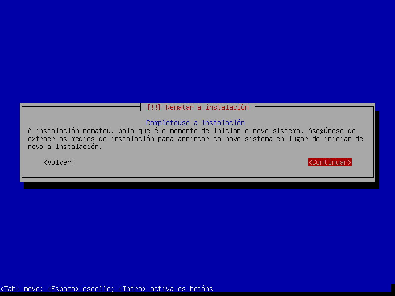


---

Se tes algún problema coa instalación podes probar con empregar o box seguinte:
 * [Documentación](https://app.vagrantup.com/belay/boxes/omv)
```ruby 
Vagrant.configure("2") do |config|
  config.vm.box = "belay/omv"
  config.vm.box_version = "1.1"
end
```
---
# 15 -Formateo deo disco agregado de 1 GB 

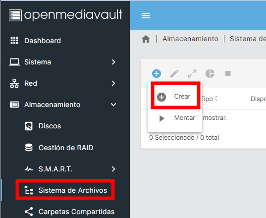
---
# 16
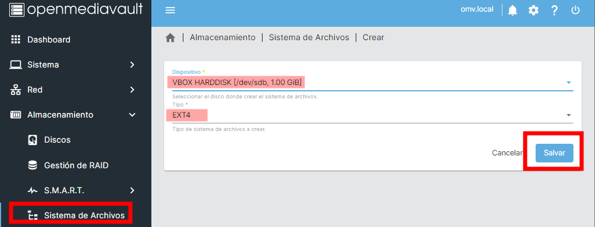

---
# 17
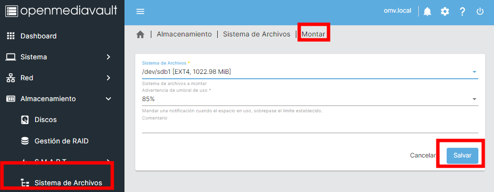

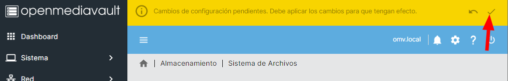

---
# 19
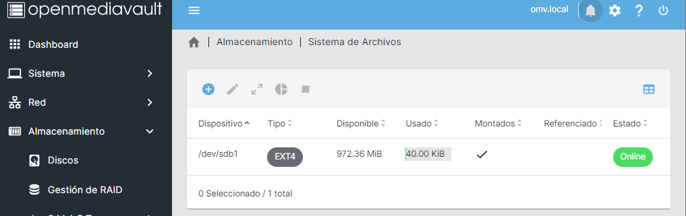

---
# Configuracion do directorio de usuarios
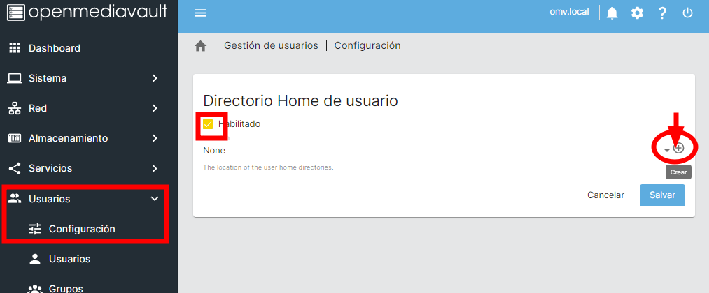

---
# Configuracion do directorio de usuarios
## Creación do directorio

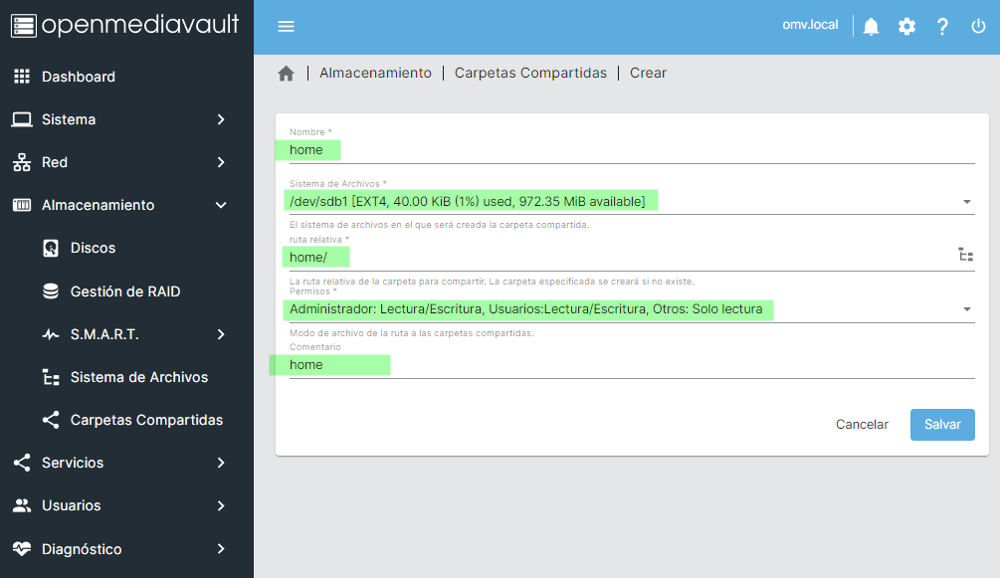

---
