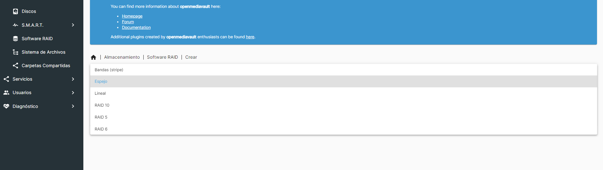
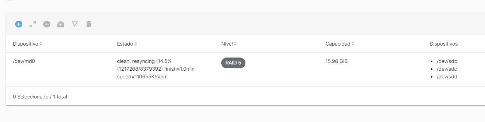
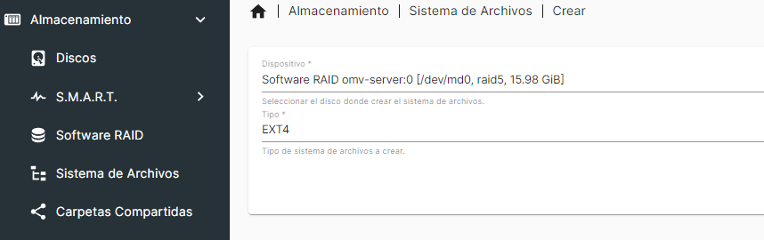
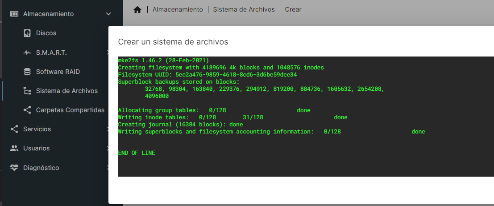
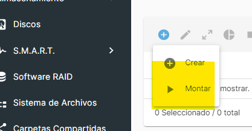
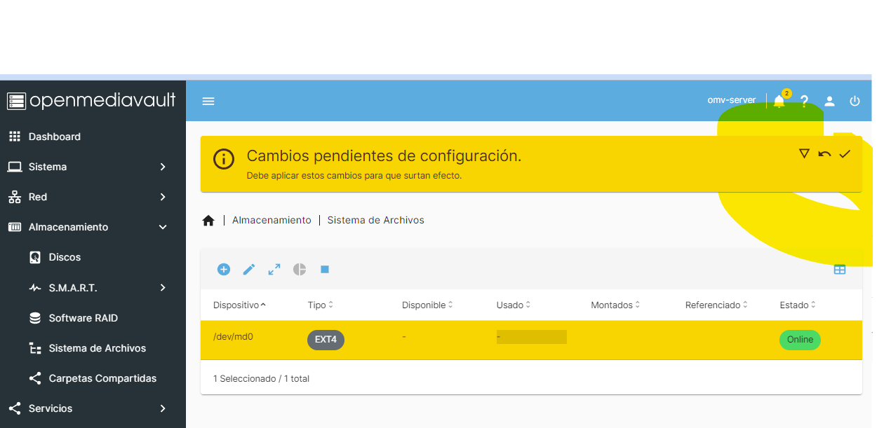
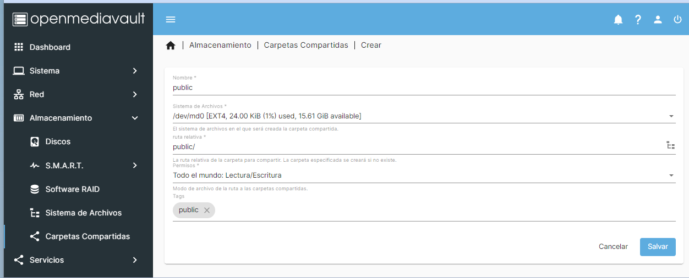
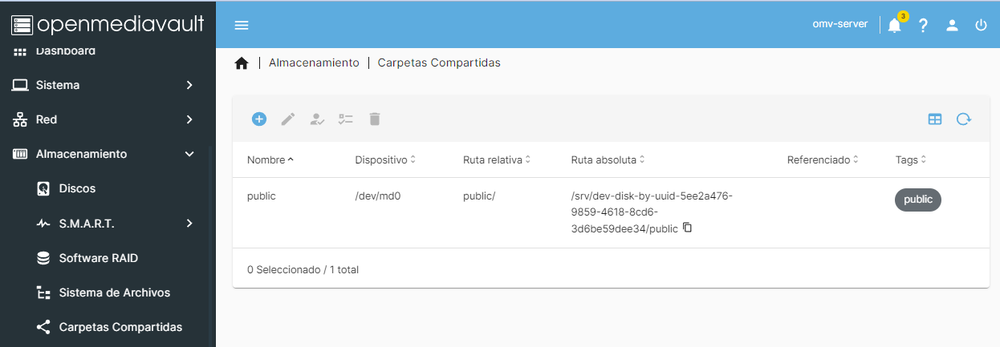

<!--
Notas para a presentación
-->
# OpenMediaVault 
 
  
<style>
  :root{
     --color-background: #101010;
     --color-foreground: #fff;
  }
  h1{
    color:#73a832;
  }

  h2{
    color:#32a883;
  }

  .anotacion {
  font-size: 10px;
}
</style>

<!-- _colorPreset: dark -->
---
# Datos xerais
* usuario por defecto: admin
* contrasinal por defecto: openmediavault
* IP de OMV 192.168.50.10
* Revisa que exista a conectividade dende o cliente windows. 
* Revisa no ficheiro **Vagrantfile** os discos precisos para crear un RAID5 
---
## Configuración cliente Windows
* Configura o teclado en español de Windows10
* Abre o powershell en modo administrador e copia a seguinte liña. 

  ```bash
  Set-WinUserLanguageList -LanguageList es-ES -Force
  ```

---
# Configuración inicial
## Configuración de rede 
* Configurar a IP como estática no sistema.
  * Rede > Interfaces > Eth0 
    * 192.168.50.10
    * 255.255.255.0
  


---
## Configuración de usuarios 
* Creación de grupo e usuarios
  * Grupos: alumnos e profes
  * Usuarios: alu01, alu02, prof01, prof02


---
# Servizo NFS
* Para poder compartir un directorio é preciso previamente ter habilitado o servizo NFS (Network File System). 


---
# Creación dun disco en rede. 
* Temos que primeira crear un sistema de ficheiros e logo montar o dispositivo. Nos empregaremos o formato EXT4. 
  


---
# Creación dun disco en rede. 
## Compartir un cartafol.


 

---
# Creación dun disco en rede. 
## Compartir un cartafol.


---
# Creación dun disco en rede. 
## Compartir un cartafol.


---
# Dende o cliente Windows


---
# Creación do RAID-5 por Software
* Precisas ter 3 discos de idéntico tamaño.
  


---
## Finaliza a creación do RAID


---
## Formateo do RAID en EXT4
* Almacenamento > Sistema de ficheiros. 
* Este paso pode tardar un pouco. 
  


---
## Finaliza o formateo do disco



---
## Montaxe do disco formateado 
* Almacenamento > Sistema de ficheiros > (+) Montar
  


---
## Aplicamos os cambios da montaxe do disco formateado 

* Este paso pode tardar un pouco. 


---
# Creación dun directorio público para o acceso de calquera persoa. 
* Fíxate nos permisos otorgados. 
  



---
## Directorio /public creado.



---
## Directorio /public creado.

