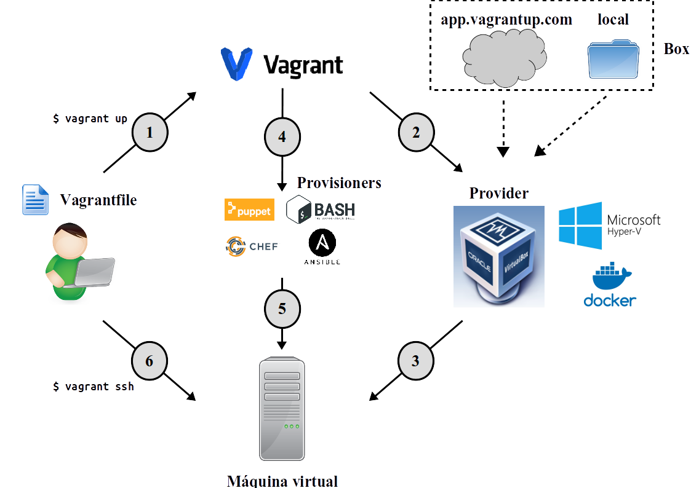
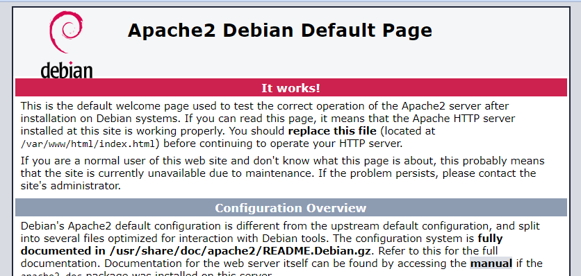
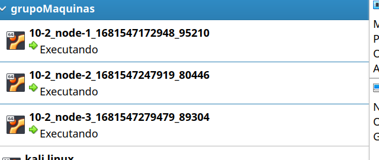

<!--
Notas para a presentación
-->
# Vagrant 

  
<style>
  :root{
     --color-background: #101010;
     --color-foreground: #fff;
  }
  h1{
    color:#73a832;
  }

  h2{
    color:#32a883;
  }

  .anotacion {
  font-size: 10px;
}
</style>

<!-- _colorPreset: dark -->
---
  - [Vagrant](#vagrant)
- [Que é?](#que-é)
- [Instalación de vagrant](#instalación-de-vagrant)
- [Que é un box?](#que-é-un-box)
- [Crear unha máquina virtual sinxela.](#crear-unha-máquina-virtual-sinxela)
- [Configuración do escenario básico](#configuración-do-escenario-básico)
- [Vagrant redirección de portos](#vagrant-redirección-de-portos)


---
# Que é? 

 * Vagrant é unha ferramenta deseñada para configurar e compartir o entorno de traballo coa mesma configuración. 
 * Emprega as tecnoloxías como os hipervisores de VirtualBox,VMWare, libvirt , ... 
 * Para adaptar unha máquina (box) podemos empregar:
   * Script shell
   * Ferramentas como: Chef, Puppet, Ansible.

---
# Instalación de vagrant

 * [Documentación](https://developer.hashicorp.com/vagrant/downloads)
* Linux  
   ```console
    wget -O- https://apt.releases.hashicorp.com/gpg | gpg --dearmor | sudo tee /usr/share/keyrings/hashicorp-archive-keyring.gpg

    echo "deb [signed-by=/usr/share/keyrings/hashicorp-archive-keyring.gpg] https://apt.releases.hashicorp.com $(lsb_release -cs) main" | sudo tee /
    etc/apt/sources.list.d/hashicorp.list

    sudo apt update && sudo apt install vagrant
   ```
* Windows
  ```ps
    winget install --id=Hashicorp.Vagrant  -e
   ```


---
# Fluxo de traballo

 


---
# Comproba a versión de Vagrant 
* Unha vez instalado comproba a versión instalada con `vagrant -v`, actualmente a última versión é a **2**. 
* Este paso é importante xa que hai elementos que dependen da versión da API de Vagrant.
* Tamén no ficheiro de configuración indicamos a versión de API coa que operamos  ` Vagrant.configure(2) do |config| `
`

---
# Que é un box? 
 * Un box é unha máquina virtual "empaquetada", podemos velo como un modelo que vamos clonar ou replicar.
* Podemos consultar e usar Boxes publicados en https://app.vagrantup.com/boxes/search 
* **Como podemos empregalos?**
   ```console
   vagrant box add {title} {url}

   #Exemplo 01
   vagrant.exe box add centos https://app.vagrantup.com/centos/boxes/7/versions/2004.01/providers/virtualbox.box
   ```

---
# Xestión dun box
 * **Onde se atopan por defecto os box?** No directorio do usuario:
   * Linux: /home/usuario/.vagrant.d/boxes 
   * Windows:  C:\Users\usuario\vagrant\
 * Como consultamos os box existentes? 
    ```bash
   vagrant box list
    ```
* Como eliminamos o box creado chamado **centos** ?
     ```bash
      vagrant box remove centos
     ```
--- 
### Xestión dun box online
* Podemos importar os BOX publicados en  https://app.vagrantup.com/, existen varias alternivas: 

* Opción 1, empregando o terminal. 
  ```bash 
    vagrant init ubuntu/trusty64
    vagrant up
    ```
* Opción 2, dende o vagranfile
  ```ruby 
   Vagrant.configure("2") do |config|
      config.vm.box = "ubuntu/trusty64"
    end
  ```
  Equivale ao seguinte:
   ```ruby 
   VAGRANTFILE_API_VERSION = "2"
   Vagrant.configure(VAGRANTFILE_API_VERSION) do |config|
      config.vm.box = "ubuntu/trusty64"
    end
  ```
 * Opción 3, descargar o box e importalo manualmente.

---
## Opcións con vagrant box 
```bash 
     $ vagrant box [opción]
   ``` 
Subcomandos dispoñibles: 
* add
* list
* outdated
* prune
* remove
* repackage
* update
---

# Crear unha máquina virtual sinxela. 
* Para cada proxecto crearemos un directorio.
* En cada proxecto teremos un ficheiro chamado **Vagrantfile**
 ```bash 
$ mkdir project
$ cd project

# Creamos o ficheiro Vagrantfile co box ubuntu16.04
$ vagrant init ubuntu/trusty64

#Levantamos a máquina
$ vagrant up 
 ```
---

## Como manipular a máquina (I)? 
* Arrincar a máquina, a primeira vez tardará algo mais ao ter que descargar o **box**
  ```bash 
     $ vagrant up
  ```
* Deter a execución da máquina
  ```bash 
     $ vagrant halt
  ```
*  Destruir os ficheiros da máquina virtual.
   ```bash 
     $ vagrant destroy
   ``` 
*  Pausar a máquina virtual.
   ```bash 
     $ vagrant pause
   ``` 
*  Reanudar a máquina virtual.
   ```bash 
     $ vagrant resume
   ``` 
---
##  Como manipular a máquina? (II)

* Conectarse por SSH 
  ```bash 
     $ vagrant ssh
  ```
* Sair da máquina virtual. **exit**
  ```bash 
    ubuntu@ubuntu-xenial:~$ exit
  ```
*  Validar unha configuración do ficheiro Vagrantfile
   ```bash 
     $ vagrant validate
   ``` 
*  Obter axuda sobre algún comando
   ```bash 
     $ vagrant COMMAND -h
   ``` 
*  Vagrant modo debug
   ```bash 
     $ vagrant up --debug
   ``` 


---
## Estado das MV
* Comprobar o estado 
  ```bash 
  vagrant status
  ```
*  Comprobar o estado de todas as MV
   ```bash 
   vagrant global-status
   ```

---
# Configuración do escenario básico
Precisamos crear unha máquina virtual con Debian Bullseye 64 bits. Que pasamos debemos seguir?
```bash
#1 Crear o directorio do escenario
mkdir escenario-debian
cd escenario-debian
#2- Baixar o box 
vagrant box add "deb/bull" 
https://app.vagrantup.com/debian/boxes/bullseye64/versions/11.20221219.1/providers/virtualbox.box 
#3- Crear o Vagrantfile plantilla 
vagrant init deb/bull 

# Revisa o ficheiro **Vagrantfile** creado
cat Vagrantfile
```
---
## Configuración do escenario básico (II) 
Precisamos as seguintes características:
* Proveedor de virtualización **virtualbox**
* Nome da MV: "probas"
* Nº de CPUS: 2
* RAM : 2GiB
* Hostname: p2

---
## Configuración do escenario básico (II) 
Solución:
```ruby
Vagrant.configure("2") do |config|
  config.vm.box = "deb/bull"
  config.vm.hostname ="p2"

  config.vm.provider "virtualbox" do |vb|
    vb.memory = "2048"
    vb.cpus = 2
    vb.name = "probas"
   end
end
```
**[ex02](exemplos/02/Vagrantfile)**

---
## Configuración do escenario básico (III) 
* Levanta a máquina e accede por ssh
  * ```ssh
      vagrant up
      vagrant ssh
    ```
* Como comprobamos os portos empregados entre a MV e o host?  
  * ```ssh
      vagrant port
    ```
* Como paramos a máquina virtual?
  * ```ssh
      vagrant halt
    ```
* Como eliminamos a MV?
  * ```ssh
      vagrant destroy
    ```
* Eliminase o ficheiro Vagrantfile? 
  * Non

---
## Configura o escenario para que arrinque a interfaz gráfica.
* Recorda que estamos empregando de proveedor Virtualbox.
*  ```ruby 
    Vagrant.configure("2") do |config|
      config.vm.box = "deb/bull"
      config.vm.hostname ="p2"

      config.vm.provider "virtualbox" do |vb|
        vb.memory = "2048"
        vb.cpus = 2
        vb.name = "probas"
        vb.gui=true
      end
    
    end
    ```
**[ex03](exemplos/03/Vagrantfile)**


---
## Configuración do escenario básico: que instale un aplicativo.
* Adapta o vagranfile para que instale o servidor web apache2.
* O ficheiro de instalación debe facerse dentro do propio ficheiro Vagrantfile
  * ```ssh
      $ sudo apt update
      $ sudo apt install apache2
      $ echo "<h1>o meu servidor web</h1>" >>/var/www/index.html 
    ```
**[ex04](exemplos/04/Vagrantfile)**

---
### Solución
```
Vagrant.configure("2") do |config|
  config.vm.box = "deb/bull"
  config.vm.hostname ="p2"

  config.vm.provider "virtualbox" do |vb|
    vb.memory = "2048"
    vb.cpus = 2
    vb.name = "probas"
    vb.gui=true
   end
 
   config.vm.provision "shell", inline: <<-SHELL
     sudo apt update
     sudo apt install apache2 -y
   SHELL
end
```
---
## Adapta o escenario  cun ficheiro script externo.
* Neste caso o ficheiro externo chamarase **script.sh** 
* O ficheiro **script.sh** ten que mostrar a seguinte mensaxe ```OLA MUNDO```
**[ex05](exemplos/05/Vagrantfile)**
* ```ruby
   config.vm.provision "shell", path: "script.sh"
  ```
* Arquivo **script.sh**
  ```bash
     #/bin/bash
    echo "ola mundo"
  ```

---
# Vagrant redirección de portos 
```vagrant 
    Vagrant::Config.run do |config|
      # Redireciona o porta 80 do guest para a porto 4567 do host
      config.vm.forward_port 80, 4567
    end
   ``` 
* forward_port é um método que recolle dous argumentos:
  * guest port - O porto na máquina virtual
  * host port -  O porto na máquina local  que imos empregar para acceder. 
* A redirección de portos aplícase durante o **vagrant up** , mais tamén podemos forzar isto unha vez lanzada con **vagrant reload**
---
## Adapta o escenario facendo nat.
* Neste caso vamos redireccionar o porto 80 do servidor web apache ao porto 8080 no anfitrión. 
* 
  ```ssh
    config.vm.network "forwarded_port", guest: 80, host: 8080
  ```
* **[ex06](exemplos/06/Vagrantfile)**
---
### Solución
```ruby
Vagrant.configure("2") do |config|
  config.vm.box = "deb/bull"
  config.vm.hostname ="p2"

  config.vm.provider "virtualbox" do |vb|
    vb.memory = "2048"
    vb.cpus = 2
    vb.name = "probas"
   # vb.gui=true
   end
   #config.vm.provision "shell", path: "script.sh"
   config.vm.provision "shell", inline: <<-SHELL
     sudo apt update
     sudo apt install apache2 -y
   SHELL
#Configuración portos
config.vm.network "forwarded_port", guest: 80, host: 8080

end
```
<!--  -->
---
## Configuración do escenario para compartir directorios. 
* [Documentación](https://developer.hashicorp.com/vagrant/docs/v2.3.0/synced-folders/basic_usage)
* Na máquina de referencia tes que:
  1. Crear un directorio chamado **tmp** no directorio do proxecto vagrant.
  2. Editar o **Vagrantfile** para que compartas o directorio creado no host dentro da máquina virtual no directorio **/tmp/src**
  3. Levanta a máquina e accede nela para crear un ficheiro de texto chamado **oTeuNome.txt**
  4. Sae da MV e revisa o directorio **tmp** no host. Apareceu algo novo?

**[ex07](exemplos/07/Vagrantfile)**
* `config.vm.synced_folder "tmp", "/tmp/src"`

---
## Exercicio: Comparte o directorio web de apache.
Na máquina de referencia tes que:
* Crea no directorio do teu proxecto vagrant o directorio web.
* Edita o Vagrantfile para que compartas o directorio creado no host dentro da máquina virtual no directorio **/var/www/html**
* No directorio web inclue o ficheiro index.html co seguinte contido
  ```html
  <!DOCTYPE html>
   <html>
    <head>
    </head>
    <body>
      <h1> Ola mundo!!! </h1>
  </html> 
  ```
* Realiza nat do porto do servidor web para o porto 8080 no host. 
---
### Solución
**[ex07-02](exemplos/07-02/Vagrantfile)**
```ruby
Vagrant.configure("2") do |config|
  config.vm.box = "deb/bull"
  config.vm.hostname ="p2"

  config.vm.provider "virtualbox" do |vb|
    vb.memory = "2048"
    vb.cpus = 2
    vb.name = "ex07-02-web"
   # vb.gui=true
   end
   #config.vm.provision "shell", path: "script.sh"
   config.vm.provision "shell", inline: <<-SHELL
     sudo apt update
     sudo apt install apache2 -y
    SHELL
config.vm.network "forwarded_port", guest: 80, host: 8080
config.vm.synced_folder "web", "/var/www/html"
end

```
---
# Configuración rede.  

* **IP estática** 
  ```ruby
  config.vm.network "private_network", ip: "192.168.33.10"
  ```
* **DHCP** 
  ```ruby
  config.vm.network "private_network", type: "dhcp"
  ```
* **Adaptador ponte** 
  ```ruby
  config.vm.network :public_network,:bridge=>"eth0"
  ```
* **Configuración nun script en liña** 

  ```ruby
   # manual ip
  config.vm.provision "shell",
    run: "always",
    inline: "ifconfig eth1 192.168.0.17 netmask 255.255.255.0 up"
    ```
---

---
## Configuración rede.  
 * Configura un equipo cunha IP estática como a seguinte
**192.168.0."número de lista".3**.
   * **[ex08](exemplos/08/Vagrantfile)**
 * Configuración en ponte de rede
   *  **[ex08-02](exemplos/08-02/Vagrantfile)**
--- 
## Configuración múltiples máquinas 
 * Creamos varias máquinas que se definen como *nodo1* e *nodo2* cadansúa empregan o mesmo box e con nomes diferentes e IPS correlativas. 
  
 ```ruby
    Vagrant.configure("2") do |config|

      config.vm.define :nodo1 do |nodo1|
        nodo1.vm.box = "precise32"
        nodo1.vm.hostname = "nodo1"
        nodo1.vm.network :private_network, ip: "10.1.1.101"
      end

      config.vm.define :nodo2 do |nodo2|
        nodo2.vm.box = "precise32"
        nodo2.vm.hostname = "nodo2"
        nodo2.vm.network :private_network, ip: "10.1.1.102"
      end
    end
  ```

* Acceso por ssh `vagrant ssh nodo1` 
* Deter unha MV  `vagrant halt  nodo1` 


---
# Xerar un box personalizado
 * Podemos xerar un box coas nosas personalizacións para elo empregamos o subcomando **package**
 * Recorda que debes empregar na base o mesmo nome que o da MV. 
 * Exemplo de uso co MV do exemplo 08-02
   * `vagrant package --base "Exemplo08-02" --output "exemplo0802.box"`


 *  Windows PowerShell: `Get-FileHash FICHEIRO -Algorithm MD5`
    *  [Documentación](https://learn.microsoft.com/en-us/powershell/module/microsoft.powershell.utility/get-filehash?view=powershell-7.3)
---
# Truco: Creación en bucle
* [Documentación](https://developer.hashicorp.com/vagrant/docs/vagrantfile/tips)
* ```ruby
    (1..3).each do |i|
      config.vm.define "node-#{i}" do |node|
        node.vm.provision "shell",
          inline: "echo hello from node #{i}"
      end
    end
  ```
---
## Exercicio
* Crea en Vagrant  un bucle con 3 equipos coa mesma configuración.
* Os equipos deben ter configurado unha tarxeta de rede de modo interna e con ips correlativas. 
* Configuración 
   *  **[ex10](exemplos/10/Vagrantfile)**

---

## Truco: Agrupar máquinas
* Podemos agrupar as máquinas dun escenario  coa propiedade *customize* para elo podemos configuralo como neste exemplo: 
```
          vb.customize ["modifyvm", :id, "--groups", "/grupoMaquinas"]
```
O resultado en virtualbox é semellante ao seguinte: 



--- 
## Agrupado en virtualbox
```ruby
IMAGE_NAME = "ubuntu/bionic64"
N = 3
Vagrant.configure("2") do |config|
    
    (1..N).each do |i|
        config.vm.define "node-#{i}" do |node|
                node.vm.box = IMAGE_NAME
                node.vm.hostname = "node-#{i}"
                node.vm.network :private_network, ip: "192.168.56.#{10+i}"                
                node.vm.provider "virtualbox" do |v|
                        v.memory = 1024
                        v.customize ["modifyvm", :id, "--groups", "/grupoMaquinas"]
                end
        end
    end
end
```

   *  **[ex10-2](exemplos/10-2//Vagrantfile)**


---
# Discos
* [Documentación](https://developer.hashicorp.com/vagrant/docs/disks/configuration)
  * Funcionalidade experimental, é preciso indicalo no ficheiro coa seguinte liña `ENV['VAGRANT_EXPERIMENTAL'] = "disks"`
* Existen 3 tipos de discos que nos permite Vagrant, estos son: **disk**, **dvd**, **floppy**
* Exemplo:
  ```ruby
  config.vm.disk :disk, name: "backup", size: "10GB"
  config.vm.disk :dvd, name: "installer", file: "./installer.iso"
  config.vm.disk :floppy, name: "cool_files"

  ```
---
## Discos - Exemplo de configuración

```ruby
#Activamos o FLAG 
ENV['VAGRANT_EXPERIMENTAL'] = "disks"


Vagrant.configure("2") do |config|

#Configuración da MV
  config.vm.define "open-media-vault" do |omv|
    omv.vm.box = "rreye/omv6"
    omv.vm.hostname = "open-media-vault"
    omv.vm.network "private_network", ip: "192.168.50.10"
    omv.vm.network "forwarded_port", guest: 80, host: 8080
    omv.vm.disk :disk, size: "2GB", name: "extra_storage1"
    omv.vm.disk :disk, size: "1GB", name: "extra_storage2"
    omv.vm.disk :disk, name: "backup", size: "10GB"

    omv.vm.provider :virtualbox do |vb1|
      vb1.name = "open-media-vault"
      vb1.cpus= "4"
   end
  end 
```

---
## Discos - Exemplo de configuración en bucle
```ruby
#VAGRANT_EXPERIMENTAL="disks"
ENV['VAGRANT_EXPERIMENTAL'] = "disks"

Vagrant.configure("2") do |config|
    config.vm.define "hashicorp" do |h|
      h.vm.box = "hashicorp/bionic64"
      h.vm.provider :virtualbox
      h.vm.disk :disk, name: "backup", size: "10GB"

      (0..3).each do |i|
        h.vm.disk :disk, size: "5GB", name: "disk-#{i}"
        
      end
    end
end
  
```
---
# Plugins en Vagrant
* Vagrant permite instalar complementos (plugins) para mellorar algunhas funcionalidades. Para elo temos os seguintes subcomandos de `vagrant plugin`:
  *  expunge
  *  install
  *   license
  *   list
  *   repair
  *   uninstall
  *   update
---
## Exemplo guiado de plugins en Vagrant
1. Instalaación dun plugin 
    ```bash 
    $ vagrant plugin install [plugin_name] 
    $ vagrant plugin install vbinfo

    ```
2. Uso do plugin instalado
    ```bash
    $ vagrant vbinfo
    ```
3. Lista de plugins instalados
    ```
    $  vagrant plugin list
    ```  
---
## Exemplo guiado de plugins en Vagrant 

4. Actualización do plugin
    ```
    $  vagrant plugin update [nome_plugin]
    ```  
5. No suposto de ter erros co plugin e precismoes reparalo
    ```
    $  vagrant plugin repair [nome_plugin]
    ```  
6. Para borrar o plugin
    ```
    $  vagrant plugin uninstall  [nome_plugin]
    ``` 
7. Para borrar todos os plugins
    ```
    $  vagrant plugin expunge
    ```   
---
## Plugins de interese
* vagrant-vbguest
  * Instala automáticamente os *vbguest*  no sistema 
  * `vagrant plugin install vagrant-vbguest`
* vagrant-winnfsd
  * Habilita a compatibilidade con NFS.
  * `vagrant plugin install vagrant-winnfsd`
* vagrant-netinfo
  * Para amosar os portos reenviados do invitado ao host.
  * `vagrant plugin install vagrant-netinfo`
* vagrant-hostmanager
  * Para configuracións de varias máquinas. 
  * `vagrant plugin install vagrant-hostmanager
`
---
# Vagrant diferentes proveedores
* Vagrant soporta que se implemente en diferentes aplicativos de virtualización como pode ser: **Virtualbox**, **Hyper-V** ou **Vmware**.
*  Podemos indicar o proveedor dende a liña de comandos do seguinte modo:
    ```bash 
    $  vagrant up --provider=vmware_fusion
    $  vagrant up --provider=virtualbox
    ```
*  Normalmente non é preciso indicar o proveedor xa que o obtén da variable de entorno  `VAGRANT_DEFAULT_PROVIDER` 


---
## Vagrant diferentes proveedores: ficheiro Vagrantfile.
* Outra estratexia é indicarlle a preferencia do proveedor no ficheiro **Vagrantfile** para elo é preciso definir `config.vm.provider`. No seguinte exemplo ten preferencia sobre vmware e se non é posible escollería virtualbox.
  ```ruby
  Vagrant.configure("2") do |config|
    # ... datos de configuración....

    # Ten prioridade VMware Fusion sobre VirtualBox
    config.vm.provider "vmware_fusion"
    config.vm.provider "virtualbox"
  end
  ```
*  [Documentación](https://developer.hashicorp.com/vagrant/docs/providers)
---

---
# Chuleta
* [Chuleta de comandos habituais](02-chuleta.md)
* [PDF Vagrant Cheat Sheet](https://cheatography.com/1101trash/cheat-sheets/vagrant/pdf/)

--- 
# Ampliación
## Vagrant empregando o proveedor docker
 ```ruby
  Vagrant.configure("2") do |config|
  config.vm.provider "docker" do |d|
    d.image = "ubuntu/lunar64"
  end
end
  ```
  Terminal:
  ```bash 
  $ vagrant up --provider=docker
  ```
  ---
# Recursos
## Documentación
* [Documentación oficial](https://developer.hashicorp.com/vagrant)
## Guías de interese

* [Práctica con Vagrant](https://josejuansanchez.org/iaw/practica-vagrant/index.html)
* [Xestionando máquinas virtuais con Vagrant](https://www.josedomingo.org/pledin/2013/09/gestionando-maquinas-virtuales-con-vagrant/)
* [Guía rápida de Vagrant](https://www.busindre.com/guia_rapida_de_vagrant)
---
## Outros recursos para ampliar
* [Openstack](https://www.josedomingo.org/pledin/2014/02/instalando-openstack-en-mi-portatil/)
* [Usando OpenStack desde Vagrant](https://www.josedomingo.org/pledin/2016/01/usando-openstack-desde-vagrant/)
* [How to use Vagrant plugins](https://brain2life.hashnode.dev/how-to-use-vagrant-plugins)
