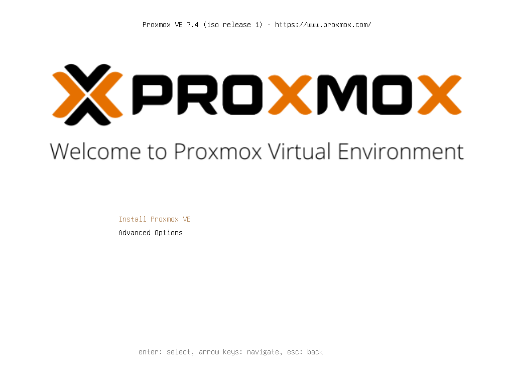

<!--
Notas para a presentación
-->
# Proxmox 

  
<style>
  :root{
     --color-background: #101010;
     --color-foreground: #fff;
  }
  h1{
    color:#73a832;
  }

  h2{
    color:#32a883;
  }

  .anotacion {
  font-size: 10px;
}
</style>

<!-- _colorPreset: dark -->
---
 

---
# Que é? 

 *  Un servidor de virtualización basado en Debian  e cuxa administración pódese realizar dende unha web. 
 *  Permite empregar as tecnoloxías de : KVM e contenedores LXC. 
 * KVM fai a reserva de recursos no intre que arrinca a MV mentras  LXC  vai reservando recursos a demanda. 
   

  * Fonte: [https://www.nine.ch/en/engineering-logbook/kvm-vs-container-en](https://www.nine.ch/en/engineering-logbook/kvm-vs-container-en)

--- 
# Instalación
* RAM: 8 GiB
* Procesadores: 8
* Disco: 120 Gib (tipo vdi con reserva dinámica)


--- 


--- 
## Configuración da ISO Booteable. 


---


---



---


--- 


---


---


---


---


---


---

---

---
# Vagrant Proxmox Provider
* [Documentación](https://github.com/telcat/vagrant-proxmox)
* Instalar o plugin 
```bash
$ Vagrant Proxmox Provider

```
Uso
```bash
$ vagrant box add dummy dummy_box/dummy.box

```
--- 

## Vagrant Proxmox Provider
O ficheiro Vagrant será semellante ao seguinte:
```ruby
Vagrant.configure('2') do |config|

    config.vm.provider :proxmox do |proxmox|
        proxmox.endpoint = 'https://your.proxmox.server:8006/api2/json'
        proxmox.user_name = 'proxmox_username@pam'
        proxmox.password = 'proxmox_password'
        proxmox.vm_id_range = 900..910
        proxmox.vm_name_prefix = 'vagrant_'
        proxmox.openvz_os_template = 'local:vztmpl/vagrant-proxmox-ubuntu-12.tar.gz'
        proxmox.vm_type = :openvz
        proxmox.vm_memory = 256
    end
    
    config.vm.define :box, primary: true do |box|
        box.vm.box = 'dummy'
        box.vm.network :public_network, ip: '192.168.0.1'
    end
    
end
```
