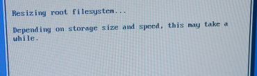
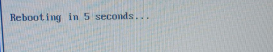
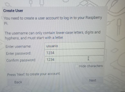

# Descargamos a imaxe para Raspberry Pi
O recomendable é que revisemos na web do proxecto Raspberry Pi as últimas versións e compatibilidades dos Sistemas Operativos. Podes consultalo nesta ligazón [https://www.raspberrypi.com/software/operating-systems/](https://www.raspberrypi.com/software/operating-systems/)

Se descargas a imaxe do sistema operativo coa extesión **img.xz** terás que descomprimila. 
```bash
unxz file.xz
```
Será preciso ter instalado **xz-utils**
```bash
 sudo apt-get install xz-utils
```


# Preparación do entorno
Temos que insertar a tarxeta MicroSD no lector de tarxetas. Posteriormente inserimos no porto USB do ordenador.  Neste punto pode ser que a tarxeta MicroSD sexa recoñecida automáticamente ainda así imos comprobalo.

## Detectar o dispositivo
```bash
# Buscamos todos os dispositivos sd*
 lsblk  |grep "sd"
```


No exemplo da imaxe temos que a tarxeta MicroSD atopase en **/dev/sdb** e que ten unha partición que ocupa todo o tamaño. 

## Desmontar o dispositivo
En ocasións o dispositivo móntase automáticamente polo cal é preciso comprobalo. Para iso empregamos o comando **df**.  Podes ver esta situación na seguinte imaxe.
```bash
df 
```


Procedemos a desmontar o dispositivo 
```bash
sudo umount -l /dev/sdb1
```


O comando  **dd** en Linux tamén se chama Data Duplicator e permítenos duplicar os datos a baixo nivel. 

Neste caso imos instalar Raspberry Pi OS Lite cuxa release é do 21 de Febreiro de 2023 [Ligazón](https://downloads.raspberrypi.org/raspios_lite_arm64/images/raspios_lite_arm64-2023-02-22/2023-02-21-raspios-bullseye-arm64-lite.img.xz). 

## Duplicamos a imaxe na tarxeta SD
O comando  **dd** en Linux tamén se chama Data Duplicator e permítenos duplicar os datos a baixo nivel.  No noso caso imos copiar a imaxe do sistema operativo na MicroSD. 


```bash
# ESTE PASO PODE SER PERIGOSO, antes de darlle ao ENTER avisa ao docente para validar o comando. 

sudo dd if=2023-02-21-raspios-bullseye-arm64.img of=/dev/sdb bs=4M conv=fsync

 
 ```

A saida será algo semellante a isto
```bash
belay@cabuxa:~/$ sudo dd if=2023-02-21-raspios-bullseye-arm64.img of=/dev/sdb bs=4M conv=fsync
[sudo] Contrasinal de belay: 
204+1 records in
204+1 records out
856089772 bytes (856 MB, 816 MiB) copied, 49,4952 s, 17,3 MB/s
belay@cabuxa:~/$ 
```
Podemos verificar que se escribiron todos os datos co comando **sync**

```bash
sync
```
Tamén é recomendable revisar que o noso dispostivo **/dev/sdb/** neste titorial xerou diferentes particións  co comando **lsblk** 

```txt
sdc           8:32   1  14,4G  0 disk 
├─sdc1        8:33   1   256M  0 part 
└─sdc2        8:34   1   3,8G  0 part 
```


# Verificación na Raspberry
Procedemos a inserir a tarxeta MicroSD na ranura e fixándose nos pins da tarxeta e do conector. Unha vez insirida a microSD conectaremos os seguintes elementos:
1. O conector HDMI ao monitor.
2. O teclado e o rato USB a Raspberry Pi
3. Procederemos a alimentar a Raspberry Pi co transformador USB. 

Chegados a este punto comezará a sair diferentes mensaxes no monitor. 

## Primeira execución.
Na primeira execución RaspiOS precisa realizar as seguintes tarefas:
1. Expandir o sistema de ficheiros na tarxeta Micro SD. 


2. Xeración das chaves SSH


3. Reinicio do equipo . 
   


4. Configuracións dos locales. 
   


5. Creación do usuario 
   

6.  Configuración do monitor.
7.  Configuración dunha rede wifi a cal ter acceso a internet e executar actualizacións. (saltamos este paso) 
8.  Reinicio do dispositivo para finalizar a configuración. 


## Segunda execución.
Na seguinte execución despois do reinicio xa non teremos que configurar o sistema operativo e xa podemos desfrutar da RaspberryPi 

Este sistema proporciona algunhas utilidades no terminal como son:

### raspinfo

### sudo raspi-config 
Esta ferramenta permite xestionar a configuración básica do sistema. 


### sudo raspi-gpio+
Este comando accede aos pins GPIO  e permite obter os valores e tamén modificalos. Exemplos:

```bash
# Obtén todos os valores do GPIO
raspi-gpio get
# Obtén os valores do GPIO co PIN 20
raspi-gpio get 20

# Muda  o valor do GPIO co PIN 20
raspi-gpio get 20 a5
```
## Seguintes execucións
Agora xa temos temos o equipo preparado para realizar instalacións e configuracións ao noso entollo.  Ainda así en ocasións é preciso xerar unha copia de seguridade da tarxeta MicroSD que veremos no seguinte apartado. 

```bash
#apgado dende o terminal
shutdown now
```

# Creación dunha copia de seguridade da tarxeta MicroSD
Neste punto apagamos a Raspberry Pi e logo quitaremos a tarxeta microSD. Logo teremos que leer a tarxeta no computador. Os pasos son:
1. Comprobar que se detecta a tarxeta co comando `lsblk` e atoparemos unha entrada semellante a /sd**c** ou /sd**b**, .... 
2. Desmontamos as particións montadas. 
```bash
sudo umount -l /dev/sdb1
sudo umount -l /dev/sdb2
```
**RECORDA que no teu equipo sdb ao mellor non existe por iso verifica no paso 1 cal é o teu.** 
3. Creación da imaxe da tarxeta SD

```bash
# Exemplo xenérico
sudo dd if=/dev/sdc of=backup-<fecha_imagen>.img status=progress

#Exemplo 2
sudo dd if=/dev/sdc of=backup-2023-01.01.img status=progress

```

   * **if=:** Input File. A ruta da tarxeta SD a copiar. 
   * **of=:** Output File. A ruta do ordenador onde se vai copiar a imaxen. 
   * status=progress:  Mostra a velocidade de copia dos datos e tamén o nº de datos que xa están copiados. 
4. Unha vez xerada a imaxe podemos comprobala `ls bac*` e fíxate que nos xerou unha **imaxe do mesmo tamaño que a tarxeta microSD**

A continuación podemos restauración é aplicar o  paso [Duplicamos a imaxe na tarxeta SD](#duplicamos-a-imaxe-na-tarxeta-sd)