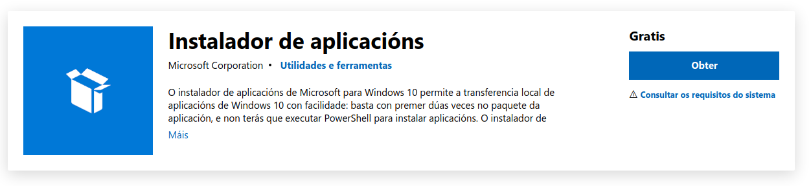
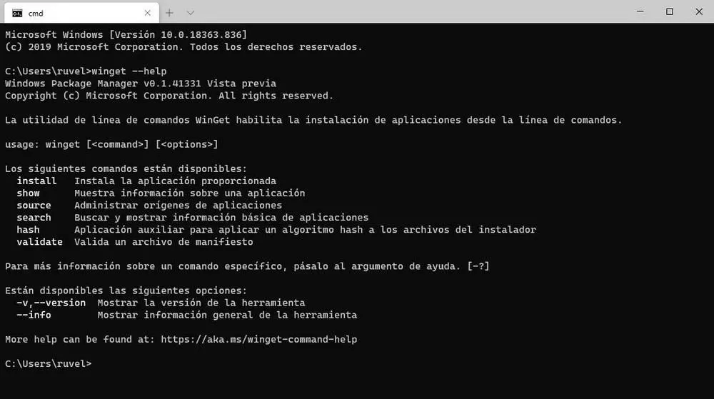
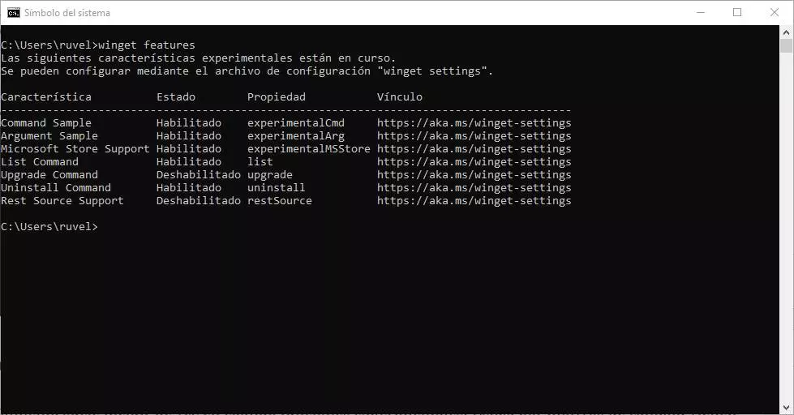
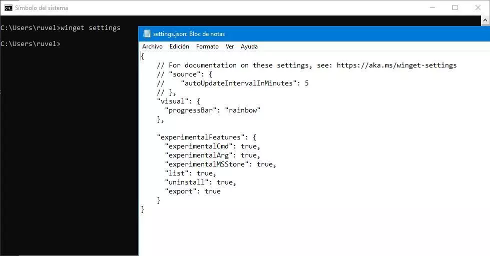

<h1>Winget </h1>

- [Winget](#winget)
  - [Instalación](#instalación)
    - [Store de Microsoft](#store-de-microsoft)
    - [Repositorio de GitHub](#repositorio-de-github)
  - [A Axuda](#a-axuda)
  - [Axustes](#axustes)
  - [Repositorios de aplicacións](#repositorios-de-aplicacións)
  - [Búsqueda](#búsqueda)
  - [Comprobar a información dunha aplicación (show)](#comprobar-a-información-dunha-aplicación-show)
  - [Instalación](#instalación-1)
  - [Lista as aplicacións instaladas.](#lista-as-aplicacións-instaladas)
  - [Actualización das aplicacións.](#actualización-das-aplicacións)
  - [Desinstalar Aplicación](#desinstalar-aplicación)
  - [Show](#show)
- [Configuracións avanzadas.](#configuracións-avanzadas)
  - [Export](#export)
  - [Import](#import)
  - [Exemplo de instalación cun script](#exemplo-de-instalación-cun-script)
  - [Ferramentas externas](#ferramentas-externas)
- [Ferramentas asociadas](#ferramentas-asociadas)
  - [winget-create](#winget-create)
- [Bibliografía](#bibliografía)
# Winget
Winget é un programa incluido nos sistemas operativos windows que nos permite instalar aplicacións dende a consola. Isto ofrécenos algunhas vantaxes como son: 
* Automizar a instalación de aplicacións. 
* Configurar a instalación de aplicacións a unha versión concreta. 
* Optimiza o tempo do adminsitrador do sistema evitando esperas na instalación. 
* Permite auditar e trazar o proceso de instalación para coñecer mellor os acontecementos no computador. 

A [Documentación do comando winget](https://docs.microsoft.com/es-es/windows/package-manager/winget/)

**Nota**: 

```
   Actualmente, la herramienta de línea de comandos winget solo se admite en Windows 10 1709 (compilación 16299) o posterior. 


   ----------------------------------------------------------------


   Puedes usar winget en Windows 10 siempre que tengas la versión 1709 o superior del sistema. Deberás instalar el paquete App Installer desde la Microsoft Store en caso de no tenerlo, e instalar Microsoft.DesktopAppInstaller_8wekyb3d8bbwe.appxbundle .
```
[Máis info](https://www.genbeta.com/windows/winget-nuevo-gestor-paquetes-windows-10-permite-instalar-apps-microsoft-store-te-explicamos-como-usarlo)

## Instalación 

### Store de Microsoft
Para instalar a aplicación manualmente podemos empregar a tenda de Microsoft. 


### Repositorio de GitHub
A outra opción é descargar a aplicación dende o repositorio de [GitHub de Winget](https://github.com/microsoft/winget-cli)
## A Axuda 
Para consultar a axuda temos diferentes alternativas:

**1- Empregando o propio comando**  
  > winget --help 

Ver as opcións de diferentes opcións:
> winget install -?



Tamén son de utilidade os seguintes comandos: 
> winget --version
> 
> winget  --info 

**2.Consultar a documentación na web**: [DOCUMENTACIÓN --HELP](https://docs.microsoft.com/es-es/windows/package-manager/winget/help)


## Axustes 
A ferramenta **winget** permite configurar funcións ***experimentais*** e que veñen desactivadas por defecto. Para activar estas funcións teremos que realizar

> winget feautures 



Se o que desexamos é  modificar esta confgiruación precisamos executar:
> winget feautures 

Isto ábrenos  un ficheiro **json** e debemos engadir a lista de **experimentalFeautres** as funcións co valor "true". 



Gardamos os cambios e a próxima vez que executemos a ferramenta xa estarán actividas as opcións. 

## Repositorios de aplicacións 
> winget source


Permítenos ver as fontes onde poderá consultar e descargar as aplicacións a ferramenta winget. 

* Listar repositorios configurados
  > winget source list

* Información detallada dun repositorio concreto. 
  > winget source list msstore
  > winget source list -name msstore


* Resetea os repositorios e para a súa execución é preciso ser administrador. 
  > winget source reset 

* Engadir un repositorio.
  > winget source add 
  > winget source add --name Contoso https://www.contoso.com/cache

* Actualizar  a información ofrecida polos repositorios. 
  > winget source update 

* Eliminar un repositorio
  > winget source remove --name Contoso

## Búsqueda 
Para realizar a búsqueda de programas teremos que empregar o comando **search** , por exemplo para buscar programas coa cadea  ***fire*** sería: 
> winget search fire 

Outro exemplo para buscar o chrome:
> winget search chrome

Outro exemplo o VLC;
> winget search vlc 


**O importante ao buscar é localizar o ID da aplicación.**
Para os anteriores casos sería:
* Vlc: VideoLan.VLC
* Chrome: Google.Chrome
* Firefox: Mozilla.Firefox
## Comprobar a información dunha aplicación (show)
Unha vez que localizamos o **id** da aplicación podemos consultar información sobre a mesma como é:
* Versión.
* Editor
* Descripción.
* Web.
* Licenza.
* ...
Uns exemplos de uso serían:
> winget show VideoLan.VLC
> winget show Google.Chrome
> winget show Mozilla.Firefox


Ollo!! Non confundas con **winget search** porque a información é mais limitada que empregando  **winget show**

## Instalación
A sintaxe do comando [install] (https://docs.microsoft.com/es-es/windows/package-manager/winget/install) é a seguinte. 

> winget install [[-q] \<query>] [\<options>]

Previamente é preciso empregar o comando **search** para localizar o identifcador. 

Exemplo de instalación de Firefox: 

> winget install Mozilla.Firefox

Algúns parámetros interesantes son:
* -h, --silent	 ==> Modo silencioso. 
* -l, --location	==> Ubicación donde instalar a aplicación, pero  **ollo non todos os aplicativos o soportan.**
 

## Lista as aplicacións instaladas. 
Para elo empregaremos o comando **list**
> winget list 

## Actualización das aplicacións. 
> winget upgrade. 


Actualiza a aplicación pasada como parámetro.
> winget  upgrade VideoLan.VLC

Actualiza todas as aplicacións instaladas. 
> winget upgrade --all 

## Desinstalar Aplicación
Permite desinstalar unha aplicación a forma máis habitual de empregalo e utilizar a selección por **--name** e por **--id** 

Sintaxe básica:
> winget uninstall [[-q] \<query>] [\<options>]

Exemplo: 
> winget uninstall --name powertoys --version 0.15.2
> winget uninstall --id "{24559D0F-481C-F3BE-8DD0-D908923A38F8}"

Ollo se a consulta que realizamos non é única vainos dar unha listaxe coas aplicacións que coinciden co filtro. 

## Show 
Amosa os metadatos dunha aplicación instalada. Sintaxe:
> winget show [[-q] \<query>] [\<options>]

* Argumentos: -q ou -? 
* Opcións:  executa no terminal **winget show -?**

# Configuracións avanzadas.

## Export
Este comando permite exportar a configuración das aplicacións instaladas. Para empregar ficheiro  json exportado teremos que empregar import. 

> winget export [-o] <output> [<options>]

## Import


Outra opción é realizar a instalación con **winget import** 
>winget import  --import-file "ficheiro.json"
>
> winget import [-i] <import-file> [<options>]


Exemplo de json:
```json
{
  "$schema": "https://aka.ms/winget-packages.schema.1.0.json",
  "WinGetVersion": "0.3.11201",
  "Sources": [
    {
      "Packages": [
        {
          "Id": "Microsoft.Teams",
          "Version": "1.5.00.4689"
        },
        {
          "Id": "Zoom.Zoom",
          "Version": "5.9.3931"
        },
        {
          "Id": "Notion.Notion",
          "Version": "2.0.23"
        },
        {
          "Id": "SlackTechnologies.Slack",
          "Version": "4.24.0"
        },
        {
          "Id": "Toggl.TogglDesktop",
          "Version": "7.5.363"
        },
        {
          "Id": "ShareX.ShareX",
          "Version": "13.7.0"
        },
        {
          "Id": "Loom.Loom",
          "Version": "0.106.2"
        },
        {
          "Id": "Discord.Discord",
          "Version": "1.0.9004"
        },
        {
          "Id": "Microsoft.Skype",
          "Version": "8.82"
        },
        {
          "Id": "Mozilla.Firefox",
          "Version": "98.0.1"
        },
        {
          "Id": "Microsoft.OneDrive",
          "Version": "22.033.0213.0002"
        }
      ],
      "SourceDetails": {
        "Argument": "https://winget.azureedge.net/cache",
        "Identifier": "Microsoft.Winget.Source_8wekyb3d8bbwe",
        "Name": "winget",
        "Type": "Microsoft.PreIndexed.Package"
      }
    }
  ]
}
```


## Exemplo de instalación cun script
Para executar o script pode ser preciso mudar as **policy** polo cal terás que mudalo. No caso de ter algún problema podes mudar o valor coa seguinte liña: 

> Set-ExecutionPolicy -ExecutionPolicy RemoteSigned -Scope LocalMachine

[Documentación sobre execution policy](https://docs.microsoft.com/en-us/powershell/module/microsoft.powershell.security/set-executionpolicy?view=powershell-7.2)

Exemplo de script: 

```ps1
#Exemplo de script de instalación con winget
winget install --id=Microsoft.Teams -e  ; 
winget install --id=Zoom.Zoom -e  ; 
winget install --id=Notion.Notion -e  ; 
winget install --id=SlackTechnologies.Slack -e  ; 
winget install --id=Toggl.TogglDesktop -e  ; 
winget install --id=ShareX.ShareX -e  ; 
winget install --id=Loom.Loom -e  ; 
winget install --id=Discord.Discord -e  ; 
winget install --id=Microsoft.Skype -e  ; 
winget install --id=Mozilla.Firefox -e  ;
winget install --id=Microsoft.OneDrive -e 

```

## Ferramentas externas
Existe ferramentas online que permite crear os "paquetes" de aplicacións máis populares. Os proxectos máis famosos son:
* [Winstall.app](https://winstall.app/)
* [Winget.rum](https://winget.run/)


# Ferramentas asociadas
##  winget-create
O Windows Package Manager Manifest Creator é unha ferramenta de código aberto deseñada para axudar aos desenvolvedores a crear, actualizar e enviar ficheiros de manifesto ao repositorio do Windows Package Manager.

Os desenvolvedores usarán esta ferramenta para enviar as súas aplicacións para usar  o xestor de paquetes de Windows.


Podes consultar máis información en:
* [Repositorio GitHub ](https://github.com/microsoft/winget-create)
* [Documentación de Microsoft](https://docs.microsoft.com/en-us/windows/package-manager/)
* [Documentación de Microsoft - Exemplo de manifest](https://docs.microsoft.com/en-us/windows/package-manager/package/manifest?tabs=minschema%2Cversion-example)


<!-- 

//TODO 
## winget-cli-restsource repository
-->

# Bibliografía
* [Documentación microsoft](https://docs.microsoft.com/es-es/windows/package-manager/winget/)
* [Deploying software packages with Winget](https://techgenix.com/software-packages-with-winget/)
* [SoftZone](https://www.softzone.es/windows-10/como-se-hace/winget/)
* [Winget, el nuevo administrador de paquetes abierto que desarrolla Microsoft](https://blog.desdelinux.net/winget-el-nuevo-administrador-de-paquetes-abierto-que-desarrolla-microsoft/)


<footer>
<p style="float:left; width: 10%;">
<a rel="license" href="http://creativecommons.org/licenses/by-sa/4.0/"></a>
</p>

<p style="float:left; width: 90%; text-align:center;">
Copyright © <a href="https://www.belay.gal">Pablo Belay Fernández, 2022 | www.belay.gal | </a>
<br />This work is licensed under a <a rel="license" href="http://creativecommons.org/licenses/by-sa/4.0/">Creative Commons Attribution-ShareAlike 4.0 International License</a>
</p>
</footer>