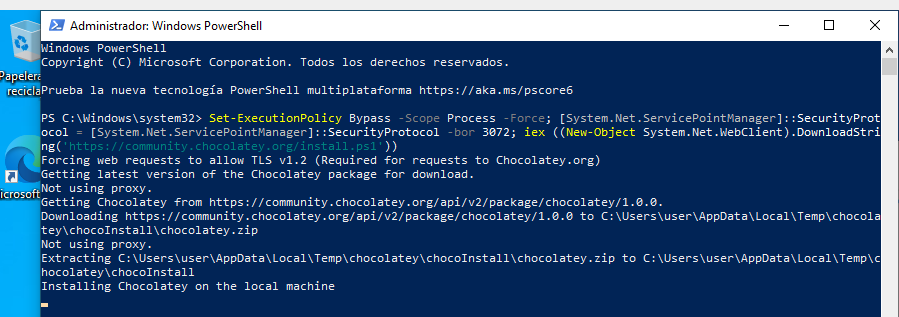

- [chocolatey](#chocolatey)
  - [Que é?](#que-é)
  - [Requisitos](#requisitos)
  - [Instalación .](#instalación-)
  - [Comandos](#comandos)
- [Casos de uso](#casos-de-uso)
  - [Búsqueda dun paquete.](#búsqueda-dun-paquete)
  - [Instalación dun paquete.](#instalación-dun-paquete)
  - [Actualización dun paquete.](#actualización-dun-paquete)
  - [Información dun paquete](#información-dun-paquete)
  - [Desinstalación](#desinstalación)
  - [Exportar a configuración.](#exportar-a-configuración)
- [Anexos](#anexos)
  - [Comandos de choco](#comandos-de-choco)
  - [Exemplos](#exemplos)
    - [Outras opcións.](#outras-opcións)

# chocolatey

## Que é? 
 Chocolatey é un xestor de paquetes e instalador a nivel de máquina para paquetes de software, creado para a plataforma Windows.

O motor de execución utiliza a infraestrutura de  empaquetado de  NuGet e Windows  PowerShell para proporcionar unha ferramenta de automatización e instalar software en máquinas Windows e foi deseñado para simplificar o proceso desde a perspectiva do usuario.

O nome é unha extensión nun xogo de palabras de  NuGet (de “ nougat” en español, turrón) porque todo o mundo ama  Chocolatey (de “ nougat  chocolat” en español, turrón de chocolate).

## Requisitos
- Windows 7 ou superior / Windows 2003+ (Server Core también, pero no Windows Nano Server)
- Windows PowerShell v2 + (aún no PowerShell Core, también conocido como PowerShell 6)
- .NET Framework 4.x +
- 2 GB de RAM 

[Máis información](https://chocolatey.org/install)

## Instalación .
A instalación permite configuralo de dúas maneiras específicas:
- Individual, para un uso "doméstico" o cal empregará os repositorios oficiales. 
- Corporativo, empregando repositorios locais no entor de traballo. Estes poden ofrecerse con diferentes tecnoloxías como son: Ansible, Chef, Puppet, PS DSC...

Para instalar a ferramentas teremos que abrir un PowerShell en modo administrador e executar a seguinte liña:
```PS
Set-ExecutionPolicy Bypass -Scope Process -Force; [System.Net.ServicePointManager]::SecurityProtocol = [System.Net.ServicePointManager]::SecurityProtocol -bor 3072; iex ((New-Object System.Net.WebClient).DownloadString('https://community.chocolatey.org/install.ps1'))
```

[Máis información consultar a documentación](https://chocolatey.org/install)


## Comandos 
Choco ten un conxunto importante de comandos os cales podemos consultar executando 
> choco comand -help

A lista completa de comandos é (Fonte: [Documentacion](https://docs.chocolatey.org/en-us/choco/commands/) ):
- search - searches remote or local packages (alias for list)
- list - lists remote or local packages
- find - searches remote or local packages (alias for search)
- info - retrieves package information. Shorthand for choco search pkgname --exact --verbose
- install - installs packages from various sources
- pin - suppress upgrades for a package
- outdated - retrieves packages that are outdated. Similar to upgrade all --noop
- upgrade - upgrades packages from various sources
- uninstall - uninstalls a package
- pack - packages nuspec, scripts, and other Chocolatey package resources into a nupkg file
- push - pushes a compiled nupkg to a source
- new - generates files necessary for a chocolatey package from a template
- source - view and configure default sources
- sources - view and configure default sources (alias for source)
- config - Retrieve and configure config file settings
- feature - view and configure choco features
- features - view and configure choco features (alias for feature)
- setapikey - retrieves, saves or deletes an apikey for a particular source (alias for apikey)
- apikey - retrieves, saves or deletes an apikey for a particular source
- unpackself - re-installs Chocolatey base files
- support - provides support information
- help - displays top level help information for choco
- export - exports list of currently installed packages
- template - get information about installed templates
- templates - get information about installed templates (alias for template)
- download - downloads packages - optionally internalizing all remote resources
- synchronize - synchronizes against system installed software - generates missing packages
- sync - synchronizes against system installed software - generates missing packages
- optimize - optimizes installation, reducing space usage
- convert - converts packages from one type to another type


# Casos de uso

## Búsqueda dun paquete.
Podemos consultar a xuda para o comando **search**
> choco search -? 
Neste comando destan as opcións:
* -d : Debug, que mostra todas as mensaxes.
* -y ou --yes : Que confirma todas as preguntas co valor "yes" 
* --timeout : Configura o tempo máximo de resposta dun comando. Exemplo  ***--timeout, --execution-timeout=VALUE***


> choco search hugo

Con este comando podemos consultar o **id** de cada aplicación no caso anterior retorna 5 resultados. 
```
PS C:\Windows\system32> choco search hugo
Chocolatey v1.0.0
hugo 0.95.0 [Approved] Downloads cached for licensed users
hugo-extended 0.95.0 [Approved] Downloads cached for licensed users
doxybook2 1.4.0 [Approved] Downloads cached for licensed users
pcwrunas 0.4.0.20161129 [Approved] Downloads cached for licensed users
zola 0.15.3 [Approved] Downloads cached for licensed users
5 packages found.
```

## Instalación dun paquete.
A sintaxe máis sinxela para instalar será:
> choco install idpaquete 

No exemplo anterior: 
> choco install hugo 

Vainos preguntar se desexamos executar o script polo cal será preciso escribir Y (yes). Unha alternativa para evitar estas cuestións e confirmalo por defecto. Isto sería:
> choco install hugo -y


## Actualización dun paquete.
> choco upgrade <pkg|all> [<pkg2> <pkgN>] [<options/switches>]


* [Documentación](https://docs.chocolatey.org/en-us/choco/commands/upgrade#mainContent)


Teremos que empregar o comando **upgrade** o cal podemos actulizar todas as aplicación ou unha concreta. 

Exemplo para actualizar a aplicación hugo:
> choco upgrade hugo 


Exemplo para actualizar todas as aplicacións: 
> choco upgrade all 

Exemplo actualizar varias aplicacións nunha liña:
> choco upgrade notepadplusplus googlechrome atom 7zip

Exemplo, actualizar todo menos unhas aplicacións concretas:
> choco upgrade all --except="'skype,conemu'"


Exemplo, actualizar a unha versión en concreto:
> choco upgrade nodejs.install --version 0.10.35

## Información dun paquete
> choco info chocolatey

> choco info googlechrome


> choco info powershell

## Desinstalación
> choco uninstall hugo

## Exportar a configuración.
Unha ferramenta útil é exportar as aplicacións instaladas nun equipo, isto vainos permitir aplicar a mesma instalación noutro equipo. O ficheiro que xera por defecto a aplicación é de tipo **XML**.

> choco export [<options/switches>]

Exemplo:
> choco export "packages.config"

O contido do ficheiro será:
```xml
<?xml version="1.0" encoding="utf-8"?>
<packages>
  <package id="chocolatey" />
  <package id="hugo" />
  <package id="winrar" />
</packages>
```

# Anexos


## Comandos de choco

| Command                                                     | Description                            |
| ----------------------------------------------------------- | -------------------------------------- |
| [list](https://chocolatey.org/docs/commands-list)           | lists remote or local packages         |
| [search](https://chocolatey.org/docs/commands-search)       | searches remote or local packages      |
| [info](https://chocolatey.org/docs/commands-info)           | retrieves package information          |
| [install](https://chocolatey.org/docs/commands-install)     | installs packages from various sources |
| [pin](https://chocolatey.org/docs/commands-pin)             | pins a package to suppress upgrades    |
| [outdated](https://chocolatey.org/docs/commands-outdated)   | retrieves packages that are outdated   |
| [upgrade](https://chocolatey.org/docs/commands-upgrade)     | upgrades packages from various sources |
| [uninstall](https://chocolatey.org/docs/commands-uninstall) | uninstalls a package                   |

See also the [Chocolatey Command Reference](https://chocolatey.org/docs/commands-reference) for a complete list.


## Exemplos 

| Command                                        | Description                                      |
| ---------------------------------------------- | ------------------------------------------------ |
| **Búsqueda de paquetes**                       |                                                  |
| `choco list`                                   | List all chocolatey packages                     |
| `choco search zip`                             | Search packages mentionning "zip"                |
| `choco search --by-tag compression`            | Search packages by their tags                    |
| `choco search --by-id-only zip`                | Search packages with "zip" in the package name   |
| `choco search --order-by-popularity zip`       | Filter and sort by package results by popularity |
| `choco search --approved-only zip`             | Only return approved packages                    |
| `choco info 7zip`                              | Get information about 7zip package               |
|                                                |                                                  |
| **Instalación**                                |                                                  |
| `choco install 7zip`                           | Install                                          |
| `choco install 7zip --install-directory=P:\7z` | Install to a specific directory                  |
|                                                |                                                  |
| **Mantemento**                                 |                                                  |
| `choco list --localonly`                       | Listar todos os paquetes instalados              |
| `choco outdated`                               | List upgradable packages                         |
| `choco upgrade all -y`                         | Upgrade all packages                             |
|                                                |                                                  |
| **Pinning**                                    |                                                  |
| `choco pin list`                               | List pinned packages                             |
| `choco pin add --name 7zip`                    | Suppress upgrades for 7zip                       |
| `choco pin remove --name 7zip`                 | Supress upgrades supression for 7zip ;)          |

Prefered search method: `choco search --by-id-only --order-by-popularity --approved-only` searchstring

### Outras opcións.

| Switches                    | Description                                           |
| --------------------------- | ----------------------------------------------------- |
| `--help`                    | Prints out the help menu.                             |
|                             |                                                       |
| `--install-directory=`VALUE | Install Directory Override                            |
|                             |                                                       |
| `-y`, `--yes`               | Confirm all prompts.                                  |
| `-f`, `--force`             | Force the behavior.                                   |
| `--what-if`                 | Don't actually do anything, simulate.                 |
|                             |                                                       |
| `--execution-timeout=`VALUE | The time to allow a command to finish.                |
| `--fail-on-standard-error`  | Fail on standard error output (stderr).               |
| `--use-system-powershell`   | Execute PowerShell using an external process.         |
|                             |                                                       |
| `--debug`                   | Show debug messaging.                                 |
| `--verbose`                 | Show verbose messaging.                               |
| `--trace`                   | Show trace messaging.                                 |
| `--log-file=`VALUE          | Log File to output to in addition to regular loggers. |
|                             |                                                       |
| `--no-color`                | Do not show colorization in output.                   |
| `--limit-output`            | Limit the output to essential information.            |
| `--no-progress`             | Do not show download progress percentages.            |
|                             |                                                       |
| `--allow-unofficial-build`  | Allow the use of an unofficial build.                 |


Podes consultar máis exemplos de uso na [Documentación](https://docs.chocolatey.org/en-us/choco/commands/export#examples)

<!-- 
# Bibliografía.
- [Chocolatey]([https://github.](https://community.chocolatey.org/))
- [6 Useful Chocolatey Command for Windows Package Management With Examples](https://anshulgnit.blogspot.com/2017/08/chocolatey-command-examples.html)
- [Buscador web de paquetes](https://community.chocolatey.org/packages)
- [Exemplos básicos](https://www.returngis.net/2015/11/chocolatey-el-gestor-de-paquetes-para-windows/)

 -->