<!--
Notas para a presentación
-->
# GLPI 

1. Descarga o axente da URL [
https://github.com/fusioninventory/fusioninventory-agent/releases/download/2.6/fusioninventory-agent_windows-x86_2.6.exe
](
https://github.com/fusioninventory/fusioninventory-agent/releases/download/2.6/fusioninventory-agent_windows-x86_2.6.exe
)
2. Procede a instalación do axente seguindo os pasos que se indican a continuación.
     

<!-- _colorPreset: dark -->

---
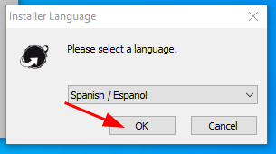

---

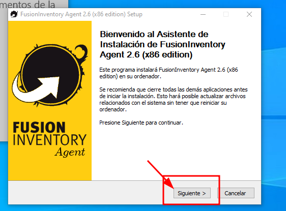

---
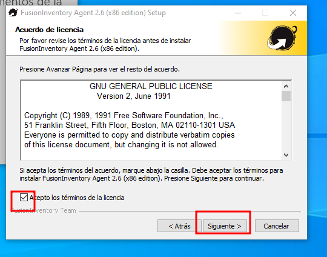

---
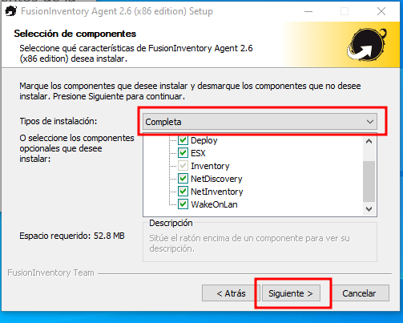

---
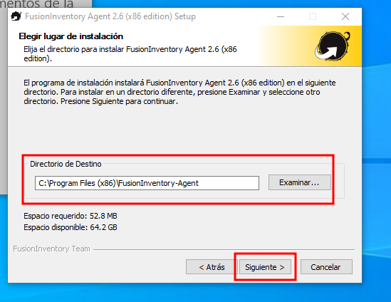

---
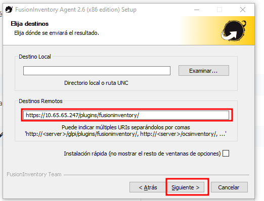

---
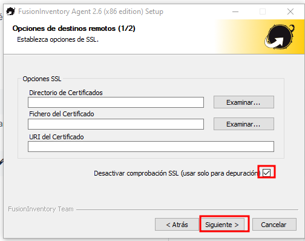

---
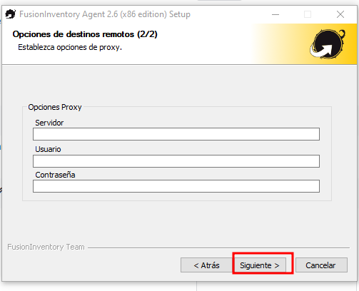

---
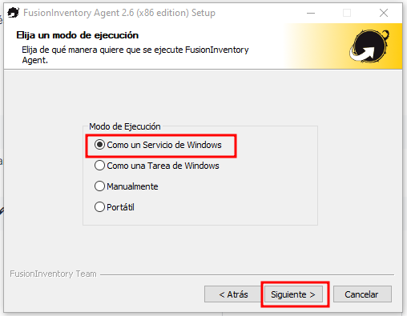

---
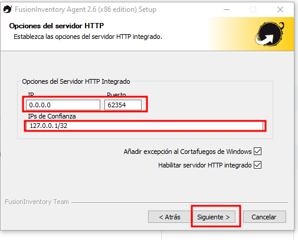

---
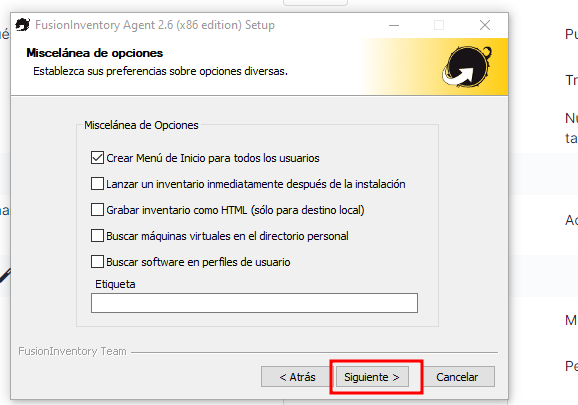

---
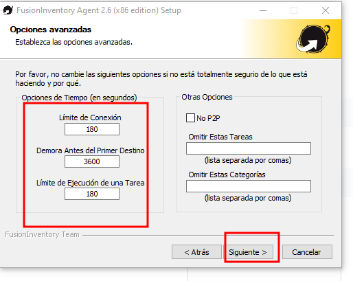

---
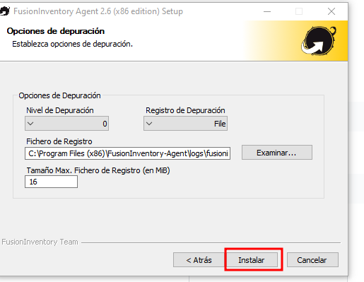

---
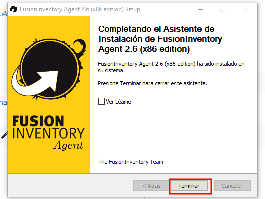

---
# Forzar o envió de información.
Este paso pode tardar uns minutos mentras non se reflexa no servidor de glpi. 

---
Voltamos atrás e veremos a planificación da seguinte execución. 

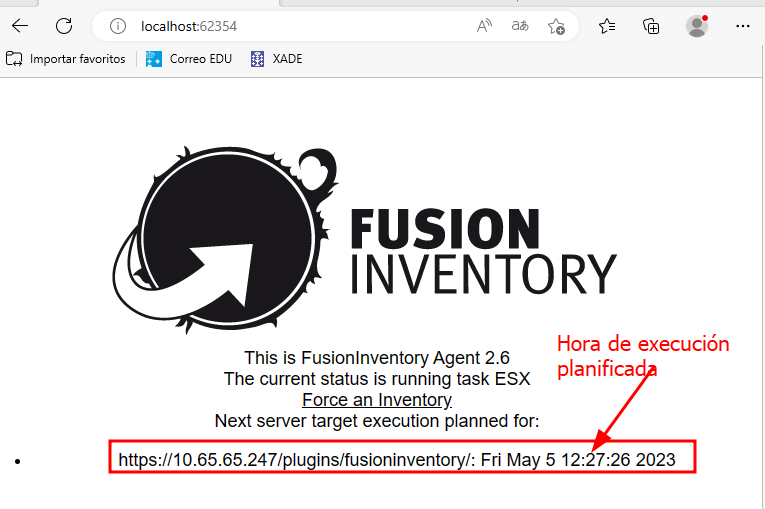

---
# Comprobamos que o axente envía os datos ao GLPI

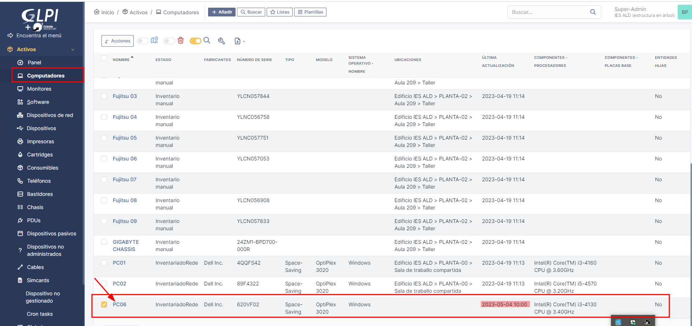

---
# Asignar localización
Asignamos o equipo ou conxunto de equipos a unha localización. 
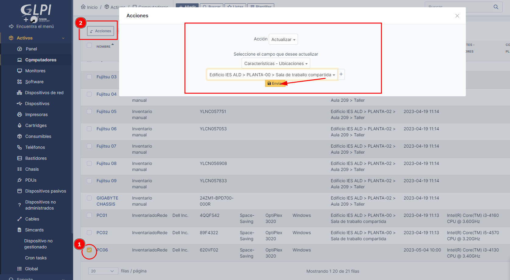
