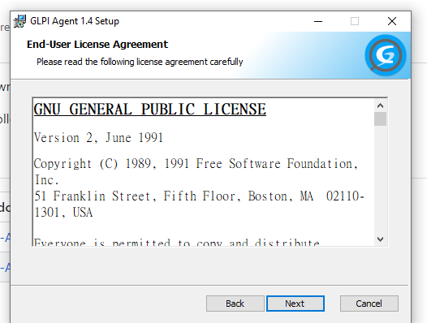

<!--
Notas para a presentación
-->
# GLPI 

  
<style>
  :root{
     --color-background: #101010;
     --color-foreground: #fff;
  }
  h1{
    color:#73a832;
  }

  h2{
    color:#32a883;
  }

  .anotacion {
  font-size: 10px;
}
</style>

<!-- _colorPreset: dark -->

---
# Configuración VagranFile

 * No ficheiro Vagrant file temos configurado dúas máquinas:
   * Servidor de GLPI con Ubuntu
   * Cliente Windows 10
  

---
# Configuración do Servidor GLPI
* Configuracion rede interna.
* NAT entre 80 e 8080. 
* Proveedor da virtualización: Virtualbox. 
 ```console
Vagrant.configure("2") do |config|
  config.vm.define "glpiv3" do |subconfig|
    subconfig.vm.box = "ubuntu/lunar64"
    subconfig.vm.hostname = "glpiv3"
    #subconfig.vm.network "private_network", ip: "192.168.30.4",  virtualbox__intnet: true, name: "rede01"
    subconfig.vm.network "private_network", ip: "192.168.56.4"
    subconfig.vm.network "forwarded_port", guest: 80, host: 8080
    subconfig.vm.provider :virtualbox do |vb1|
        vb1.name = "glpiv3"
        vb1.cpus= "2"
    end
    #.... continua 
 ```

---
# Configuración do Servidor GLPI, execución do script.
 ```bash
  subconfig.vm.provision "shell", inline: <<-SHELL
         #....
          sudo apt-get update
          sudo apt install zip -y 
          sudo apt install -y apache2 libapache2-mod-php
           php-mysql mariadb-server php-mbstring php-curl
           php-gd php-xml php-intl php-ldap php-apcu php-xmlrpc php-cas php-zip php-bz2
          sudo echo "date.timezone = Europe/Madrid" >> /etc/php/8.1/apache2/php.ini
          cd /var/www/html
          wget https://github.com/glpi-project/glpi/releases/download/10.0.6/glpi-10.0.6.tgz
          tar -xf glpi-10.0.6.tgz
    #.... continua 
```
* Instálanse todas as dependencias: PHP, Apache, Mysql,...
* Descargase de Github a versión 10.0.6 de GLPI 
* Configúrase a base de datos 
---
## Configuración do Servidor GLPI, finalización. 
* Mostra un resumo dos datos de configuración do servidor de GLPI
* Para rematar a instalación temos que acceder no navegador de host a ***http://localhost:8080/glpi/install/install.php*** para indicar os datos precisos. 
 ```console
    glpiv3: Para finalizar a instalación accede a:
    glpiv3:      http://localhost:8080/glpi/install/install.php
    glpiv3: Base de datos:
    glpiv3:      glpi
    glpiv3: Usuario da dase de datos:
    glpiv3:      glpi
    glpiv3: Contrasinal do usuario da dase de datos:
    glpiv3:      Password1234
```

---
### Configuración navegador

  
 

---
### Configuración navegador

  
 

---
### Configuración navegador

  
 

---
### Configuración navegador

  
 

---
### Configuración navegador

  
* Recorda cambiar as contrasinais dos usuarios por defecto. 


---  

# Cliente Windows 10 
 ```bash 
      config.vm.define "win-03-glpi" do |subconfig|
      subconfig.vm.box = "gusztavvargadr/windows-10-21h2-enterprise-ltsc"
      subconfig.vm.hostname = "win-01-glpi"
      subconfig.vm.network "private_network", ip: "192.168.56.5"
      subconfig.vm.provider :virtualbox do |vb2|
        vb2.name = "win-glpi-v3"
        vb2.cpus= "2"
      end
    end
 ``` 

---  
## Win10.
* Dende virtualbox podes acceder ao cliente windows cos datos de acceso:
  * usuario: vagrant
  * contrasinal: vagrant 
* Descargamos o axente de glpi na máquina
  * [URL: GLPI v.1.4](https://github.com/glpi-project/glpi-agent/releases/tag/1.4) a versión 64 bits. 
  * Configura o teclado do sistema en **español**
 ```ps
 Get-WinUserLanguageList      #obtemos o idioma de configuración 

 #mudamos o idoma a español 
 Set-WinUserLanguageList -LanguageList es-ES -Force

```
---  
## Verifica que tes acceso a GLPI dende Windows10
* Realiza un ping ao servidor de GLPI para verificar a conectividade.
  * ping 192.168.56.4
* Accede no navegador ao servidor web de GLPI
  * [http://192.168.56.4/glpi](http://192.168.56.4/glpi)
* Datos de acceso por defecto: 
  * usuario por defecto: glpi
  * contrasinal do usuario: glpi 
* Activa a configuración de inventariado en  **Administración>Inventario>** na opción "ENABLE" inventario 
  
---  
## URL  para os axentes?

* http://192.168.56.4/glpi/front/inventory.php  
---  
## Instalación axente GLPI 

  
  
 
---
## Instalación axente GLPI 
  
  

---
## Instalación axente GLPI 
  
  

---
## Instalación axente GLPI 
  
  

---
## Servizo web
Se o axente executase como un servizo, a súa interface web debería estar accesible en http://localhost:62354. 


---
## Configuración do axente. 
* Consultar a documentación en función do Sistema operativo.
  * [Web](https://glpi-agent.readthedocs.io/en/latest/installation/)
* Abrimos unha consola de Powershell no directorio **C:\Program Files\GLPI-Agent**
 ```ps
 PS C:\Program Files\GLPI-Agent> dir
    Directory: C:\Program Files\GLPI-Agent
Mode                 LastWriteTime         Length Name
----                 -------------         ------ ----
d-----         3/11/2023   5:18 PM                etc
d-----         3/11/2023   5:18 PM                logs
d-----         3/11/2023   5:18 PM                perl
d-----         3/11/2023   5:18 PM                share
d-----         3/11/2023   5:18 PM                var
-a----          7/1/2022   9:35 AM            127 glpi-agent.bat
-a----          7/1/2022   9:35 AM            125 glpi-esx.bat
-a----          7/1/2022   9:35 AM            130 glpi-injector.bat
-a----          7/1/2022   9:35 AM            131 glpi-inventory.bat
-a----          7/1/2022   9:35 AM            134 glpi-netdiscovery.bat
-a----          7/1/2022   9:35 AM            134 glpi-netinventory.bat
-a----          7/1/2022   9:35 AM            128 glpi-remote.bat
 ```


--- 
## ***C:\Program Files\GLPI-Agent***\glpi-agent.bat
* O axente permite os seguintes modos de execución:
  * **Xestionado**, o axente execútase en segundo plano e esperta en función da configuración indicada polo servidor. Isto permite realizar peticións non planificadas. 
  * **Semi-xestionado**, o axente só se executa dacordo a unha configuración local da computadora e *nese intre solicita ao servidor as tarefas a realizar*. 
    * Habitualmente dispárase en local con cron ou o programador de tarefas. 
  * **Autónomo**, só se executa coas indicacións locais da computadora.

---
 <div class="wy-table-responsive"><table class="docutils align-default">
<thead>
<tr class="row-odd"><th class="head"><p>Modo de execución</p></th>
<th class="head"><p>Planificación da execución</p></th>
<th class="head"><p>Tarefas a realizar</p></th>
</tr>
</thead>
<tbody>
<tr class="row-even"><td><p>Xestionado</p></td>
<td><p>Control do servidor</p></td>
<td><p>Control do servidor</p></td>
</tr>
<tr class="row-odd"><td><p>Semi-Xestionado</p></td>
<td><p>Control do axente</p></td>
<td><p>Control do servidor</p></td>
</tr>
<tr class="row-even"><td><p>Autónomo</p></td>
<td><p>Control do axente</p></td>
<td><p>Control do axente</p></td>
</tr>
</tbody>
</table></div>

--- 
## Ferramentas:  glpi-agent
* [Documentación](https://glpi-agent.readthedocs.io/en/latest/man/glpi-agent.html)
 ```ps
 $ glpi-agent [options] [--server server|--local path]
 ```
 ```console
Target scheduling options:
  --delaytime=LIMIT              maximum delay before first target,  in seconds (3600).... (continúa)
  --lazy                         do not contact the target before next scheduled time
  --set-forcerun                 set persistent state 'forcerun' option so a run will be started immediately during a start or init
Task selection options:
  --list-tasks                   list available tasks and exit
  --no-task=TASK[,TASK]...       do not run given task
  --tasks=TASK1[,TASK]...[,...]  run given tasks in given order
Inventory task specific options:
  --no-category=CATEGORY         do not list given category items
  --list-categories              list supported categories
  --scan-homedirs                scan user home directories (false)
  --scan-profiles                scan user profiles (false)
  --html                         save the inventory as HTML (false)
  --json                         save the inventory as JSON (false)
  -f --force                     always send data to server (false)
  --backend-collect-timeout=TIME timeout for inventory modules
                                   execution (30)
  --additional-content=FILE      additional inventory content file
  --partial=CATEGORY             make a partial inventory of given category
                                   items, this option implies --json
  --credentials                  set credentials to support database inventory
 ```
 --- 

## Ferramentas:  glpi-inventory
* [Documentación](https://glpi-agent.readthedocs.io/en/latest/man/glpi-inventory.html)
 ```ps
 $ glpi-inventory [options]
  ```
```

 Options:
  --scan-homedirs                scan use home directories (false)
  --scan-profiles                scan user profiles (false)
  --html                         save the inventory as HTML (false)
  --json                         save the inventory as JSON (false)
  --no-category=CATEGORY         do not list given category items
  --partial=CATEGORY             make a partial inventory of given category items, this option implies --json
  --credentials                  set credentials to support database inventory
  -t --tag=TAG                   mark the machine with given tag
  --backend-collect-timeout=TIME timeout for inventory modules execution (30)
  --additional-content=FILE      additional inventory content file
  --verbose                      verbose output (control messages)
  --debug                        debug output (execution traces)
  -h --help                      print this message and exit
  --version                      print the task version and exit   
```
 --- 
## Ferramentas:  glpi-injector
* Usarémola para probar o  servidor ou facer inventario ao noso interese.
* [Documentación](https://glpi-agent.readthedocs.io/en/latest/man/glpi-injector.html)
 ```ps
 $  glpi-injector [options] [--file <file>|--directory <directory>|--stdin|--useragent <user-agent>]
  ```
```ps
  Options:
  -h --help      this menu
  -d --directory load every inventory files from a directory
  -R --recursive recursively load inventory files from <directory>
  -f --file      load a specific file
  -u --url       server URL
  -r --remove    remove succesfuly injected files
  -v --verbose   verbose mode
  --debug        debug mode to output server answer
  --stdin        read data from STDIN
  --useragent    set used HTTP User-Agent for POST
  -x --xml-ua    use Client version found in XML as User-Agent for POST
  -x --json-ua   use Client version found in JSON as User-Agent for POST
  --no-ssl-check do not check server SSL certificate
  -C --no-compression don't compress sent XML inventories 
  ```
--- 
## Modo xestionado.
**C:\Program Files\GLPI-Agent**

 ```ps
 #Exemplo xenérico
 $ glpi-agent --server http://glpi/ --daemon
 ```

 ```ps
 #Exemplo na práctica.
 $  .\glpi-agent.bat  --server  http://192.168.56.4/glpi/front/inventory.php --daemon
 ```
 Este modo cunha configuración errónea é sinxelo que sature o servidor de GLPI polo cal existe a opción lixeira ou de preguiza. 
 ```ps
 #Modo preguiza
 $ glpi-agent --lazy  --server  http://192.168.56.4/glpi/front/inventory.php
 ```
 --- 
## Modo autónomo.
**C:\Program Files\GLPI-Agent**

 ```ps
#Exemplo na práctica.
#Xera un ficheiro json co inventariado do equipo.
.\glpi-inventory.bat --json > inventory.json 

#Envía o ficheiro ao servidor.
.\glpi-injector --file inventory.json --url  http://192.168.56.4/glpi/front/inventory.php


 .\glpi-inventory.bat | curl --data @- http://192.168.56.4/glpi/front/inventory.php

 ```
---
 ## Modo manual.
* Podes subir o ficheiro de inventario a web de GLPI.
* A opción atópase en: Administración>Inventario na pestana "Import from file"
  

--- 
## Resumo

```powershell
glpi-inventory --json > inventory.json
glpi-injector --file inventory.json --url http://my.first.glpi/
glpi-injector --file inventory.json --url http://my.second.glpi/

```
---
 # Tarefas:
 ## T1 - Cliente Windows 10
 ## T2 - Cliente Ubuntu
 ## T3 - Cliente android
 ---
 ## T1 - Cliente Windows 10
 - Crea unha nova máquina windows10 coa seguinte configuración:
   - CPU: 2 ; RAM: 3GiB
   - Tarxeta de rede: (rede interna)
   - Nome da computadora: PC02-"*o teu nome de pila*"
   - IP: 192.168.56.6 
   - usuarios: maria e juana
 - Sincroniza esta computadora con GLPI  para que realice o inventario. 
 - **Elementos a entregar**
   - Ficheiro JSON co inventario da computadora e co nome **pc02.json**
   - Captura na que se vexa  sincronización do equipo en GLPI co nome **pc02-01.png** 
   -  Captura de *Administración>Logs*  e ten que amosar  que existe a conexión do axente  **pc02-02.png** 
 ---
 ## T2 - Cliente Ubuntu
 - Crea unha nova máquina de Ubuntu coa seguinte configuración:
   - CPU: 3 ; RAM: 2GiB
   - Tarxeta de rede: (rede interna)
   - Nome da computadora: PC03-"*o teu apelido*"
   - IP: 192.168.56.7
 - Sincroniza esta computadora con GLPI  para que realice o inventario. 
 - **Elementos a entregar**
   - Ficheiro JSON co inventario da computadora e co nome **pc03.json**
   - Captura na que se vexa  sincronización do equipo en GLPI co nome **pc03-01.png** 
   -  Captura de *Administración>Logs*  e ten que amosar  que existe a conexión do axente  **pc03-02.png** 
 ---
 ## T3 - Cliente android
 - Crea unha nova máquina con Android coa seguinte configuración:
   - CPU: 2 ; RAM: 2GiB
   - Tarxeta de rede: (rede interna)
   - Nome da computadora: Mobil01-"*o teu apelido*"
   - IP: 192.168.56.9
 - Sincroniza esta computadora con GLPI  coa aplicación de inventariado.
 - **Elementos a entregar**
   - Ficheiro JSON co inventario da computadora e co nome **X01.json**
   - Captura na que se vexa  sincronización do equipo en GLPI co nome **X01-01.png** 
   -  Captura de *Administración>Logs*  e ten que amosar  que existe a conexión do axente  **X01-02.png** 
