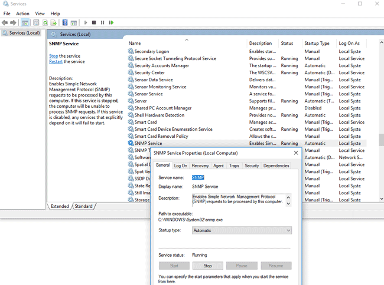

<!--
Notas para a presentación
-->
# GLPI & SNMP

  
<style>
  :root{
     --color-background: #101010;
     --color-foreground: #fff;
  }
  h1{
    color:#73a832;
  }

  h2{
    color:#32a883;
  }

  .anotacion {
  font-size: 10px;
}
</style>

<!-- _colorPreset: dark -->

---
# SNMP? 
* Protocolo que permite recopilar a información sobre os dispositivos conectados a unha rede de forma estandarizada nun contexto heteroxeneo de hardware e software.
* Actualmente hai 3 versións:
  * **SNMP v1** (1988-  (RFC 1028), só contempla equipos de 32bits.
  * **SNMP v2**, ofrece soporte a 64bits e envía datos críticos en forma de texto plano (sen cifrado), isto é un problema en termos de seguridade. Existe revisión desta versión como son:  SNMP v2p,  SNMP v2u e SNMP v2c
  * **SNMP v3**, Esta versión é a aconsellada en termos de seguridade, pero tamén é mais complexa a súa configuración e capacidade de procesado. 

  

---
# SNMP v3
* SNMP v3 ten tres niveis de seguridade:
  * **NoAuthNoPriv**:
    * Non  precisa autenticación e as mensaxes non están cifradas. 
    * Esta configuración debe ser puntual ou en redes pechadas e seguras.
  * **AuthNoPriv**:
    * Precisa  autenticación e as mensaxes non están cifradas
  * **AuthPriv**: 
    * Precisa  autenticación e as mensaxes non están cifradas
    * Esta  implementación é a máis segura. 
  * [Amplía información nesta ligazón](https://www.paessler.com/es/it-explained/snmp)

----
# Instalar o cliente SNMP en Windows10 (I)
* Comproba que o Windows10 ten conexión a internet.
* Abre un terminal de powershell en modo administrador, executa o seguinte:
   ```PS
     Add-WindowsCapability -Online -Name "SNMP.Client~~~~0.0.1.0"
    ```
* Verifica que se instalou correctamente.
   ```PS
     Get-WindowsCapability -Online -Name "SNMP*"
    ```
    
* Se desexas desinstalalo terías que executar: ```Remove-WindowsCapability -Online -Name "SNMP.Client~~~~0.0.1.0"```

---
# Configuración de SNMP
* Abre o xestor de servizos ```services.msc```
* Aparecen estous dous servizos:
  * **Servicio SNMP**, actúa como un axente que envía información.
  * **SNMP Trap**, recolle as mensaxes de captura dos axentes SNMP para ser procesados pola computadora en local. 
  

---
# Configuración do servizo SNMP.
Abre as propiedades do  servizo SNMP. Se está detido, reiníciao e configurao cun inicio automático. 


---
# Configuracion SNMP.
* Agregamos un nome de comunidade chamado **public** e lle indicamos os permisos de **lectura e escritura**
* Fíxate que o ideal e que só sexa de **lectura**.
* Agrega a IP dos servidores que lle permitimos realizar peticións (whitelist).
* Garda os cambios e reinicia o servizo. 


---
# Abre os portos no Firewall 
* SNMP emprega **UDP** como protocolo de transporte. 
* Emprega os portos: UDP 161 (SNMP) y UDP 162 (SNMPTRAP). 
* Podemos abrir os puertos SNMP no Firewall de Windows empregando os comandos:
  ```ps
   #Abre o porto 161 en dirección de entrada
   netsh advfirewall firewall add rule name="SNMP UDP Port 161 In" dir=in action=allow protocol=UDP localport=161
   #Abre o porto 161 en dirección de saída
   netsh advfirewall firewall add rule name="SNMP UDP Port 161 Out" dir=out action=allow protocol=UDP localport=161

   netsh advfirewall firewall add rule name="SNMPTRAP UDP Port 162 In" dir=in action=allow protocol=UDP localport=162

   netsh advfirewall firewall add rule name=" SNMPTRAP UDP Port 162 Out" dir=out action=allow protocol=UDP localport=162

  ```
---
## Configuración de SNMP como política de grupo.
* Accede a ```gpedit.msc``` e logo na árbore busca:  
  * Configuración da Computadora > Políticas > Definición de Plantillas administrativas > Rede > SNMP.


---

Hai tres parámetros de política SNMP posibles:
* Especificar comunidades - le permite establecer una lista de comunidades para el servicio SNMP;
* Especificar administradores permitidos - le permite especificar una lista de hosts permitidos que pueden enviar consultas SNMP al agente en esta computadora;
* Especificar trap para la comunidad pública : Le permite configurar la trampa para el Protocolo simple de administración de red.

---
# Configuración de GLPI
* Para permitir realizar o inventariado pola rede é preciso instalar **OCS Inventory NG** para elo activaremos o MarketPlace  na sección **configuración>plugins**.
* Buscamos  OCS Inventory NG e o instalamos. 
* 
---
## Instalación do plugin OCS Inventory 
