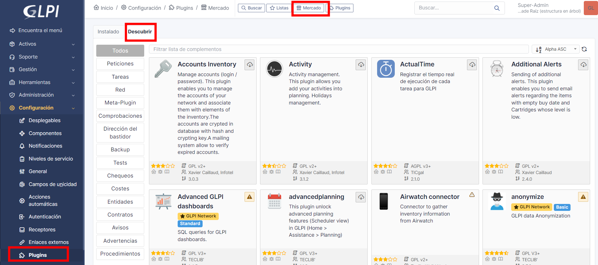
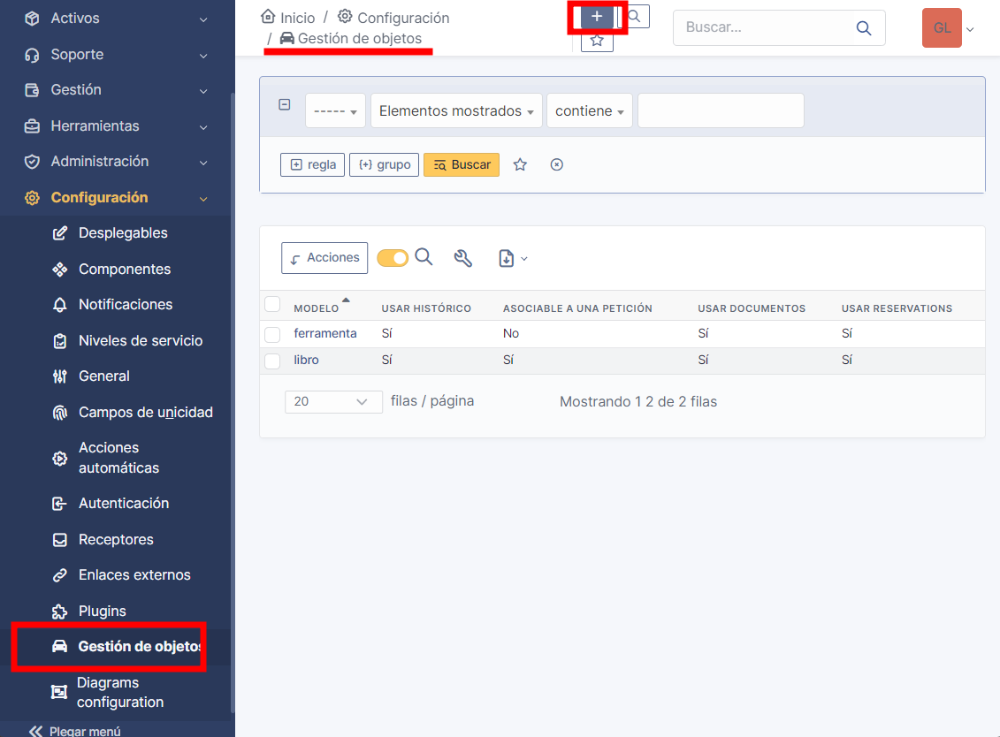

<!--
Notas para a presentación
-->
# Plugins
   
<style>
  :root{
     --color-background: #101010;
     --color-foreground: #fff;
  }
  h1{
    color:#73a832;
  }

  h2{
    color:#32a883;
  }

  .anotacion {
  font-size: 10px;
}
</style>

<!-- _colorPreset: dark -->

---
# Plugins

Os plugins poden ser instalados de duas maneiras: 
* Configurando a "tenda de aplicacións" 

* Descomprimindo o plugin no directorio  **/var/www/html/glpi/plugins** e recorda que o propietario e grupo debe ser  www-data
```bash
 tar -xvf glpi-qrticket-0.4.2.tar.gz 
 chown www-data:www-data
```

---
# Objects management
Permítenos crear categorías para rexistar elementos diferentes aos que trae por defecto GLPI.  Por exemplo se queremos inventariar: libros, conxuntos de ferramentas, ... 



Logo de crear diferentes categorías estas poderan mostrarse no menú de activos. 

---
