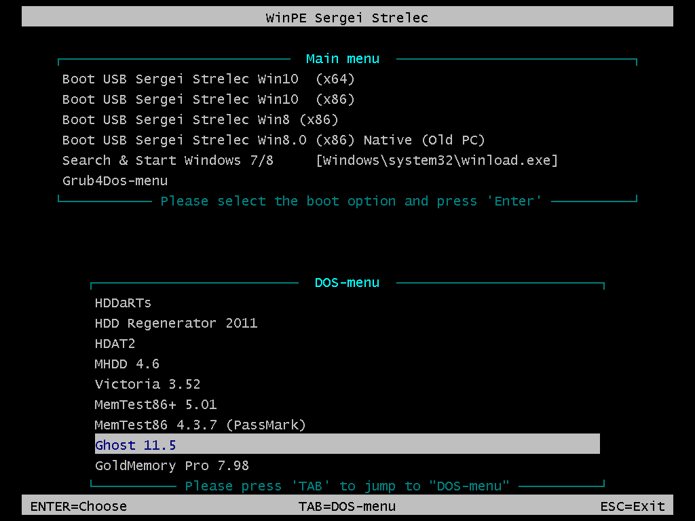
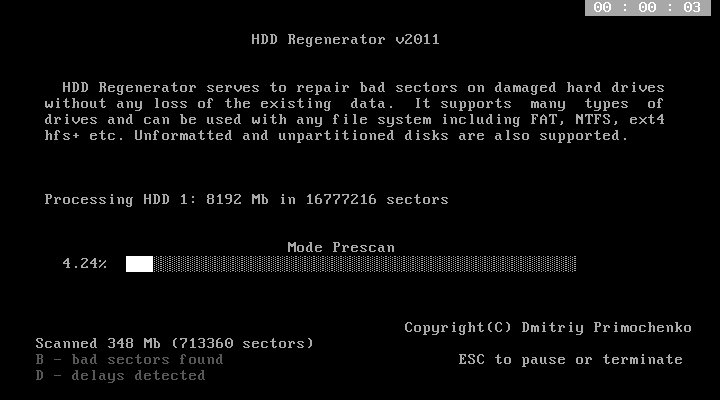
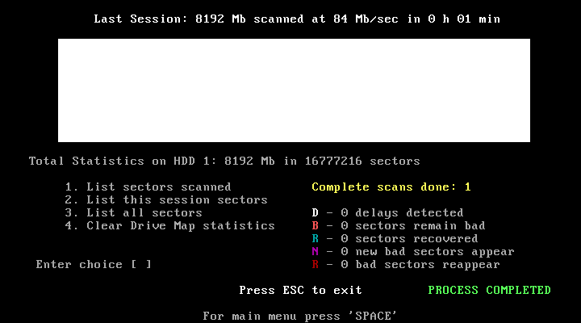
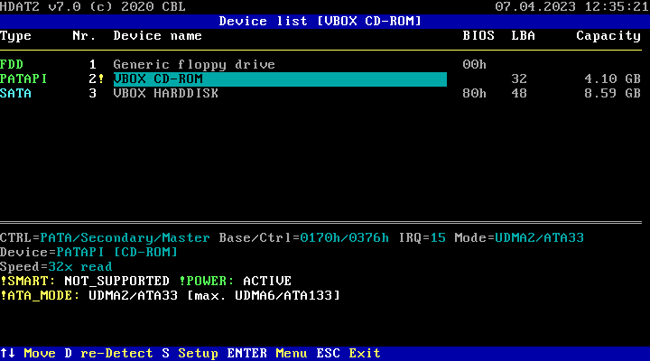
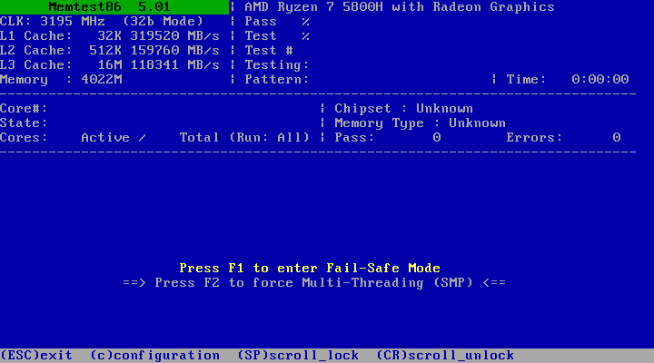
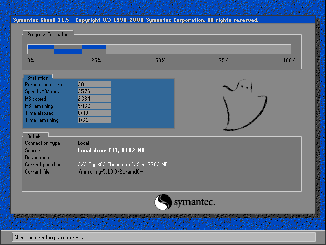
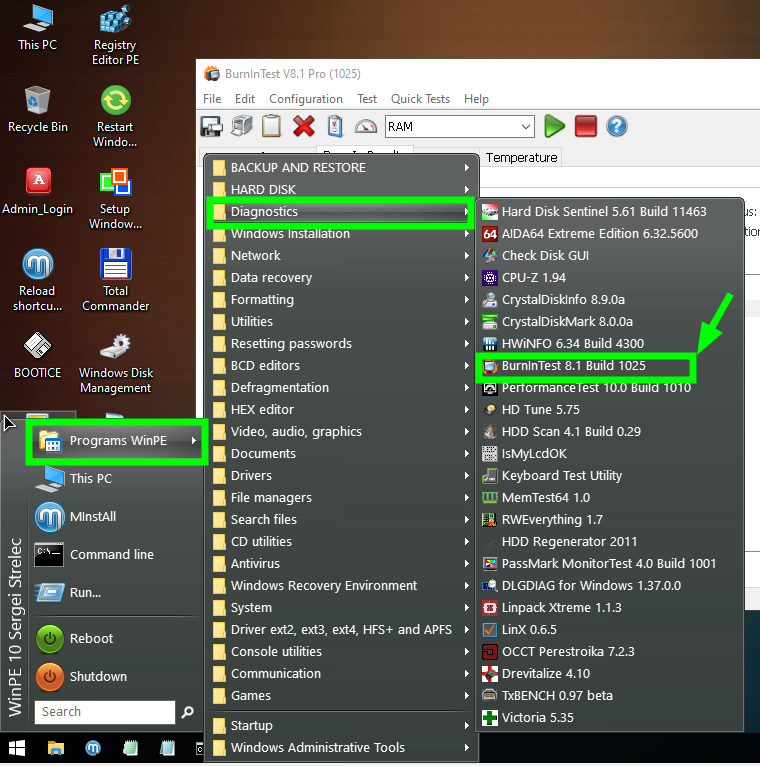
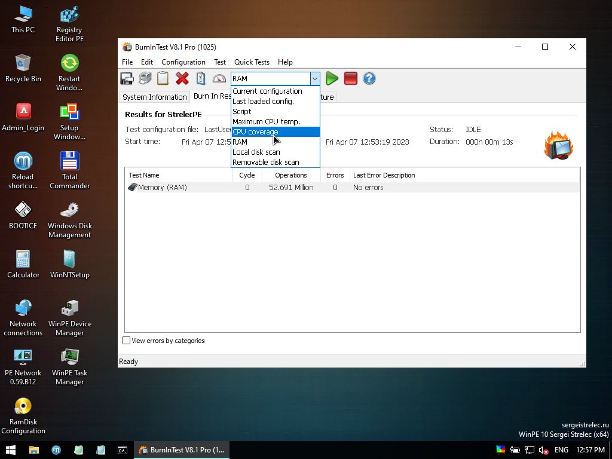

<!--
Notas para a presentación
-->
# WinPE Sergei Strelec 
   

<!-- _colorPreset: dark -->
---
- [WinPE Sergei Strelec](#winpe-sergei-strelec)
- [Que é?](#que-é)
- [Primeiros pasos](#primeiros-pasos)
- [Dos-Menu](#dos-menu)
  - [Dos-Menu: HDD Regenerator](#dos-menu-hdd-regenerator)
  - [Dos-Menu: HDD Regenerator](#dos-menu-hdd-regenerator-1)
  - [Dos-Menu: HDAT21](#dos-menu-hdat21)
  - [Dos-Menu: Memtest86](#dos-menu-memtest86)
  - [Dos-Menu: Symantec Ghost](#dos-menu-symantec-ghost)
- [WinPE Sergei Strelec.](#winpe-sergei-strelec-1)
  - [WinPE Sergei Strelec. BurnIn Test](#winpe-sergei-strelec-burnin-test)
  - [WinPE Sergei Strelec. BurnIn Test](#winpe-sergei-strelec-burnin-test-1)
  - [WinPE Sergei Strelec. Outras ferramentas de diagnóstico.](#winpe-sergei-strelec-outras-ferramentas-de-diagnóstico)
  - [WinPE Sergei Strelec. Outras ferramentas de diagnóstico.](#winpe-sergei-strelec-outras-ferramentas-de-diagnóstico-1)
  - [WinPE Sergei Strelec.](#winpe-sergei-strelec-2)
  - [Backup e restauración.](#backup-e-restauración)
  - [WinPE Sergei Strelec. Ferramentas destacadas:](#winpe-sergei-strelec-ferramentas-destacadas)

---
- [WinPE Sergei Strelec](#winpe-sergei-strelec)
- [Que é?](#que-é)
- [Primeiros pasos](#primeiros-pasos)
- [Dos-Menu](#dos-menu)
  - [Dos-Menu: HDD Regenerator](#dos-menu-hdd-regenerator)
  - [Dos-Menu: HDD Regenerator](#dos-menu-hdd-regenerator-1)
  - [Dos-Menu: HDAT21](#dos-menu-hdat21)
  - [Dos-Menu: Memtest86](#dos-menu-memtest86)
  - [Dos-Menu: Symantec Ghost](#dos-menu-symantec-ghost)
- [WinPE Sergei Strelec.](#winpe-sergei-strelec-1)
  - [WinPE Sergei Strelec. BurnIn Test](#winpe-sergei-strelec-burnin-test)
  - [WinPE Sergei Strelec. BurnIn Test](#winpe-sergei-strelec-burnin-test-1)
  - [WinPE Sergei Strelec. Outras ferramentas de diagnóstico.](#winpe-sergei-strelec-outras-ferramentas-de-diagnóstico)
  - [WinPE Sergei Strelec. Outras ferramentas de diagnóstico.](#winpe-sergei-strelec-outras-ferramentas-de-diagnóstico-1)
  - [WinPE Sergei Strelec.](#winpe-sergei-strelec-2)
  - [Backup e restauración.](#backup-e-restauración)
  - [WinPE Sergei Strelec. Ferramentas destacadas:](#winpe-sergei-strelec-ferramentas-destacadas)
  
 

---
# Que é? 

---
#  Primeiros pasos
* Crea un USB Booteable coa ISO de WinPE Sergei Strelec.
* A continuación configura o equipo para que arrinque dende o USB. 
* Ao arrincar amósa diferentes ferramentas agrupadas en dos menus:
  * Main Menú, que inclue diferentes versións de Strelec en función da arquitectura e do sistema operativo.
  * DOS-Menu, ferramentas  cun uso concreto como é a validación do disco, memoria ram,... 

---
# Dos-Menu

---
## Dos-Menu: HDD Regenerator
* [Documentación](https://usbtor.ru/viewtopic.php?t=1260)
* Permite o diagnóstico e a reparación do disco. Inclue os seguintes escaneos:
  * 1. Preescan
  * 2. Escaneo normal con e sen reparación dos sectores.
  * 3. Versión 
  * 4. Amosar as estatísticas 

---

## Dos-Menu: HDD Regenerator

---

## Dos-Menu: HDAT21
* Permite o diagnóstico e a reparación do disco.

---
## Dos-Menu: Memtest86
* Permite realizar probas a memoria RAM dun computador. 
  * O CD inclue tamén  **MemTest86 PassMark** que é moi semellante.   

---
## Dos-Menu: Symantec Ghost 
* Permite analizar o disco duro, crear imaxes dos discos, particións,   restaurar imaxes. 
* [Manual de uso](https://www.redeszone.net/2014/06/01/manual-de-utilizacion-de-norton-ghost/)

---
# WinPE Sergei Strelec.
* O sistema WinPE Sergei Strelec precisa os seguintes recursos:
  * 1 GB de RAM
  * Un dispositivo dende o que bootear (CD/USB/...)
* O SO ven cargado de ferramentas para o diagnóstico e a realización de probas do sistema. 

---
## WinPE Sergei Strelec. BurnIn Test 
* Este sóftware vainos permitir **estresar** todos os compoñentes do computador e tamén personalizar o test. 
* **Recomendase** que empreguemos esta ferramenta antes de entregar ao cliente un equipo ou cando mercamos un novo computador para verificar o seu funcionamento. 
* Proporciona ate 11 tests diferentes que se poden configurar por separado ou nunha combinación deles. 
* 

---
## WinPE Sergei Strelec. BurnIn Test 

---

## WinPE Sergei Strelec. Outras ferramentas de diagnóstico.
* Análise do disco duro:
  * **CristalDiskInfo**, obtemos os datos do disco e a información SMART.
  * **CristalDiskMark**, permítenos realizar un test de estrés obtendo a velocidade de lectura e escritura dun disco.
  * **HDDScan**, ferramenta de pago que nos permite realizar o mesmo que as dúas anteriores. Os **test** permite entre: verificación. lectura, escritura, borrado e *mariposa*.
  * **HDD Tune**, permítenos realizar test de carga sobre o disco e a vez monitorizar a velocidade. Inclúe outras opcións como o escaneo de erros, o borrado, ... 

--- 

## WinPE Sergei Strelec. Outras ferramentas de diagnóstico.

  * Teclado
    * **Keyboard TestUtility**, 
  * Comprobar o hardware instalado.
    * Aida64
    * CPU-Z
  * Comprobar o monitor
    * IsMyLCDOK, permíntenos realizar diferentes probas sendo interesante as opcións vertical,horizaontal, paint lines (f4),... 

--- 
## WinPE Sergei Strelec. 
## Backup e restauración.

  * Neste menú inclúense unha chea de ferramentas para a xestión de imaxes como son:
    * Acronis
    * AOEMEI
    * Macrium
    * Veritas
    * Symatec Ghost

--- 
## WinPE Sergei Strelec. Ferramentas destacadas:
* Recuperación de datos:
  * Data recovery > EaseUS Data Recovery ou O&O Disk
* Formateo de discos:
* Reseteo de claves
  * Resetting Passwords
 