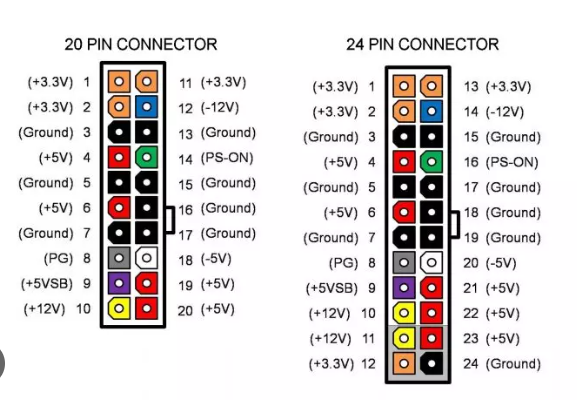
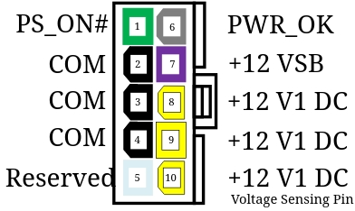
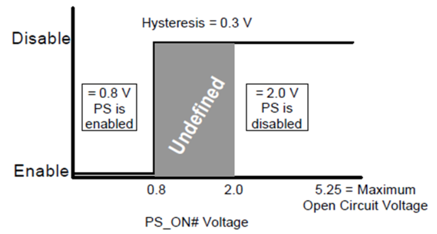

<!--
Notas para a presentación
-->
ATX3.0 e ATX12VO

<!-- _colorPreset: dark -->
--- 
Índice

- [Introducción](#introducción)
- [ATX12VO](#atx12vo)
  - [ATX12VO - PS\_ON#](#atx12vo---ps_on)
  - [ATX12VO - POWER\_OK:](#atx12vo---power_ok)
  - [ATX12VO - Rango de funcionamento](#atx12vo---rango-de-funcionamento)
  - [ATX12VO, 12VSB](#atx12vo-12vsb)
  - [ATX12VO, +12 V1 DC x3](#atx12vo-12-v1-dc-x3)
  - [ATX12VO - Outros pins](#atx12vo---outros-pins)
  - [ATX12VO, eficiencia](#atx12vo-eficiencia)
  - [ATX12VO, vantaxes:](#atx12vo-vantaxes)
  - [ATX12VO, desvantaxes:](#atx12vo-desvantaxes)
--- 
Índice
- [ATX 3.0](#atx-30)
  - [ATX 3.0: Resumo da versión (1/2)](#atx-30-resumo-da-versión-12)
  - [ATX 3.0: Resumo da versión (2/2)](#atx-30-resumo-da-versión-22)
  - [ATX 3.0: 12VHPWR](#atx-30-12vhpwr)
  - [ATX 3.0: Melloras](#atx-30-melloras)
  - [ATX 3.0 problemática na especificación.](#atx-30-problemática-na-especificación)
  - [ATX 3.0 : Exemplo Hall of Fame 1300W ATX 3.0](#atx-30--exemplo-hall-of-fame-1300w-atx-30)
  - [Intel Talks New ATX 3.0 And ATX12VO 2.0 Power Specifications |](#intel-talks-new-atx-30-and-atx12vo-20-power-specifications-)

---

# Introducción
* Na actualidade as fontes de alimentación empregan o standar ATX 2
* Os conectores característicos desta versión son:
  * ATX 20 pins.
  * ATX 24 pins (EATX -Enchanced ATX / ATX Mellorado ) 

  
 <!--   -->

---

#  ATX12VO
* **ATX12VO** son as siglas de  **ATX 12-volt-only**, especificación publicada no 2019 por Intel. Esta especificación procura mellorar a eficiencia. 
* Esta norma destaca por:
  * Únicamente proporciona 12V no conector de saída. 
  * Proporciona un conector con só 10 pins. 
  * As placas bases teñen que transformar a voltaxe para os dispositivos que funcionan con  3.3V e 5V (Por exemplo dispositivos SATA)
<!--   -->
  

---  

## ATX12VO - PS_ON#
* Ligazón a [especificación](https://edc.intel.com/content/www/us/en/design/products-and-solutions/processors-and-chipsets/alder-lake-s/atx12vo-12v-only-desktop-power-supply-design-guide/2.0/ps-on-required/)
* Funcionamento:
  *  **acende** a fonte **cando se cambia de nivel alto a baixo** 
  *  **apágase** ao pasar de **baixo a alto** ou en circuíto aberto.
  *  Permite que a placa base poida controlar á PSU. 

   

---

Sinal de funcionamento PS_ON

<!--   -->

Fonte: [Intel: ATX12VO Desktop Power Supply](https://bityl.co/GRZi)

---  
## ATX12VO - POWER_OK:
* Tamén chamado Power_Good
* Indica que as voltaxes ofrecidas pola PSU son correctas e non vai danar aos dispositivos.
* Características [destacables](https://bityl.co/GRZy):
  * Sinal compatible con +5V 
  * Nivel lóxico báixo: <0.4V  e 4 mA
  * Nivel lóxico alto:  entre 2.4V e 5V e  200 μA

---  
## ATX12VO - Rango de funcionamento

* [Especificación](https://bityl.co/GRZx)

---
## ATX12VO, 12VSB

*  Voltaxe proporcionado en repouso a fonte de 12V
*  Esta saída sempre está activa. 
*  Exemplos de uso:
   *  O control de enerxía 
   *  Wake on LAN, wake-on-modem
   *  Detección de intrusións
   *  **modos alternativos de baixa potencia (ALPM) ou actividades de estado de suspensión.**
      *  ALPM,  Alternative Low Power Mode 

---
## ATX12VO, +12 V1 DC x3
* Pins que proporcionan 12V  e ten que cumprir co requisitos de 240VA
* A seguinte táboa resume os tamaños de pasos transitorios de saída esperados para cada saída.
  * A taxa de variación de carga transitoria é = 1,0 A/μs. Todos os elementos da táboa seguinte son OBLIGATORIOS, a menos que se indique especificamente como RECOMENDADO.

---
## ATX12VO - Outros pins

* **COMx3**: Son os conectores a terra (GND)
* **Reservado**: É un pin sen función a día de hoxe.

---
## ATX12VO, eficiencia

---
## ATX12VO, vantaxes:
- Simplifica o deseño da fonte de alimentación, que non necesita integrar tantos sistemas de conversión para ofrecer varias voltaxes, só 12v.
- Abarata o custo das fontes de alimentación.
- Reduce o tamaño do conector da fonte de alimentación dende os 24 pines do ATX ata os 10.
- **Non ocupa tanto espazo** na placa base e  permite incorporar outras funcionalidades. 
- Mellórase a estética dentro da torre para o modding.

---
## ATX12VO, desvantaxes:
- Traslada o problema de complexidade da PSU á placa base,
  -  Ten que agregar os conversores para outras voltaxes se algún dos seus compoñentes o precisa.
-  Encarece o prezo da placa base.
-  As actuais placas bases e fontes de alimentación non son compatibles
-  Traslada o problema da eficiencia enerxética a placa base .

---
# ATX 3.0

---
## ATX 3.0: Resumo da versión (1/2)
- Mantense o esquema de voltaxes dos diferentes conectores.
- Incorpora o conector 12VHPWR
- Non contempla o conector Floppy Drive Connector 
- Recomenda os seguintes conectores opcionais:
  - PCI Express* (PCIe*) 2x3 Auxiliary Power Connector 
  

---
## ATX 3.0: Resumo da versión (2/2)
- Recomenda os seguintes conectores opcionais:
  - PCI Express* (PCIe*) 2x4 Auxiliary Power Connector 

---
## ATX 3.0: 12VHPWR

- ATX 3.0 ten como novidade un novo conector o **12VHPWR** para el estándar PCI Express 5.0

---
## ATX 3.0: Melloras
-  Tempos de activación do sistema máis curto (encendido máis rápido).
-  Tecnoloxía Alternative Low Power Mode (ALPM) 
-  Soportaría ate 3 GPU
-  Mellora a eficiencia ate un 60% para cargas de 10W.
-  Soporta unha potencia dun 200% durante 100 microsegundos
- Pode acadar potencias de ata 2600W.

---
## ATX 3.0 problemática na especificación.
* Neste [blog](https://www.masterbitzreviewhn.com/post/la-laguna-en-la-especificaci%C3%B3n-de-la-fuente-de-alimentaci%C3%B3n-atx-3-0) explican algúns dos problemas existentes con este novo standard. 
  * Reinicios do sistema a causa de picos de consumo. Isto era producido pola tarxeta gráfica consumía máis enerxia do que podería o conector. 
  

---
## ATX 3.0 : Exemplo Hall of Fame 1300W ATX 3.0
* GALAX anuncia a fonte Hall of Fame (HOF) de 1300W e con ATX 3.0. 

[Máis información](https://liukin.es/galax-anuncia-la-fuente-de-alimentacion-hall-of-fame-1300w-atx-3-0-con-dos-conectores-de-alimentacion-de-16-pines/)

 

--- 
## Intel Talks New ATX 3.0 And ATX12VO 2.0 Power Specifications |

 